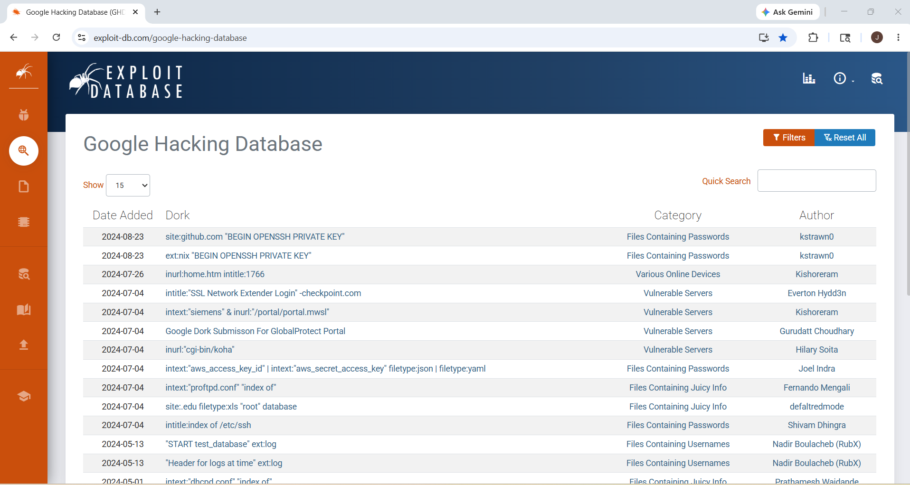
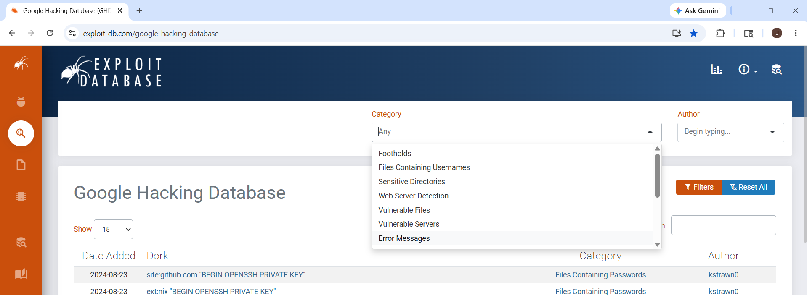
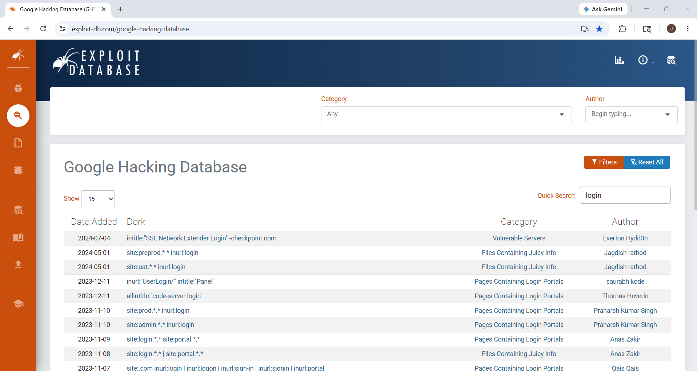
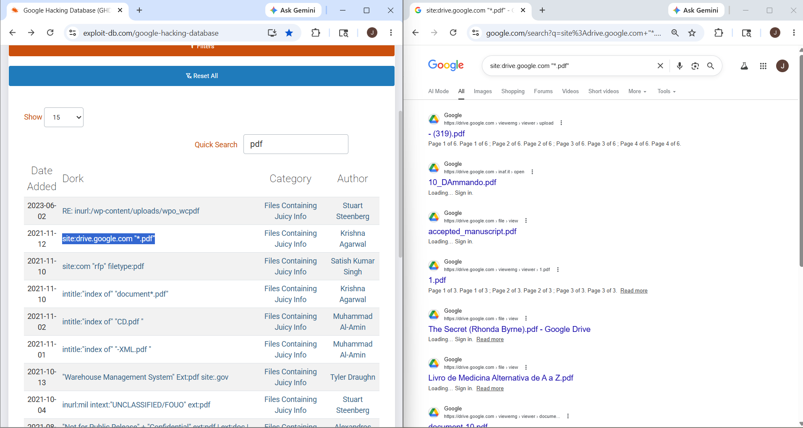

# How to Use GHDB (Google Hacking Database)

## 1. Overview

The **Google Hacking Database (GHDB)** is a public collection of ready-made Google search queries (called **Google Dorks**) used to find publicly exposed information on the internet.

Instead of creating advanced search queries manually, GHDB provides prebuilt search patterns that can be used for:

- finding exposed files
- discovering login pages
- locating open directories
- identifying misconfigured systems
- checking public exposure

GHDB is maintained by **Exploit Database (Exploit-DB)**.

---

## 2. Why It Matters

GHDB is useful because it saves time.

Instead of manually building complex Google search queries, security professionals can use GHDB to:

- quickly find useful search patterns
- discover public exposure faster
- identify misconfigured assets
- improve reconnaissance
- perform exposure checks

This makes GHDB useful in:

- OSINT
- Footprinting
- Reconnaissance
- Security auditing
- Exposure assessment

---

## 3. How GHDB Works

GHDB is a searchable database of **Google Dorks**.

Each entry in GHDB contains:

- a search query (Google Dork)
- category
- author
- purpose

These queries use advanced Google operators such as:

- `site:`
- `inurl:`
- `intitle:`
- `filetype:`
- `intext:`

Instead of building these queries manually, you can search GHDB and reuse relevant ones.

---

## 4. How to Access GHDB

GHDB is available on Exploit-DB.

### Official Website
https://www.exploit-db.com/google-hacking-database

### Steps to Open GHDB

1. Open browser
2. Go to Exploit-DB GHDB page
3. Open Google Hacking Database
4. Use search bar or filters
5. Review available Google Dorks

---

## 5. Understanding the GHDB Interface

The GHDB page contains:

- **Search bar** → search for dorks
- **Filters** → narrow by category
- **Dork list** → available search queries
- **Category** → type of result
- **Author** → who submitted it

This helps quickly find relevant dorks.

---

## 6. How to Use GHDB 

### Step 1: Open GHDB

Open the official GHDB page in browser.

This shows the searchable database of Google Dorks.

### Step 2: Search for a Keyword

Use the search bar to search for a topic such as:

- login
- pdf
- admin
- config
- backup

This filters dorks related to that keyword.

### Step 3: Review Matching Dorks

GHDB will show matching Google Dorks.

Each result usually contains:

- search query
- category
- author
- short purpose

Read the dork and understand what it searches for.

### Step 4: Select a Relevant Dork

Choose a dork based on your purpose.

Example purposes:

- find login pages
- find public PDFs
- find open directories
- find indexed admin panels

### Step 5: Copy the Dork

Copy the selected Google Dork.

Example:
intitle:login

### Step 6: Use It in Google Search

Paste the dork into Google search.

Google will return filtered search results based on the query.

### Step 7: Analyze Results

Review the results carefully.

Check for:

- indexed pages
- exposed files
- public portals
- open directories
- public resources

---

## 7. Practical Example

### Goal
Find public login pages.

### Search in GHDB
Search keyword:
login

GHDB may show a related dork such as:
intitle:login

### Use in Google
Paste into Google:
intitle:login

### Result
Google returns pages with "login" in the title.

### Security Use
Useful for identifying publicly exposed login portals.

---

## 8. Another Example

### Goal
Find public PDF files.

### Search in GHDB
Search keyword:
pdf

GHDB may show a dork using:
filetype:pdf

### Use in Google
filetype:pdf cybersecurity

### Result
Returns public PDF documents related to cybersecurity.

### Security Use
Useful for finding public reports and exposed documents.

---

## 9. Example Workflow

A simple GHDB workflow:

1. Open GHDB
2. Search keyword
3. Select dork
4. Copy dork
5. Paste in Google
6. Review results
7. Identify public exposure

This is the normal GHDB usage flow.

---

## 10. Security Use Cases

Security professionals use GHDB for:

- public exposure checks
- OSINT
- reconnaissance
- login portal discovery
- document discovery
- open directory detection
- misconfiguration checks
- security audits

---

## GHDB for VPN Discovery

GHDB contains Google Dorks that can help locate publicly indexed VPN-related pages.

These dorks search for:

- VPN login pages
- SSL VPN portals
- remote access gateways
- VPN configuration files
- exposed key files
- vendor-specific VPN interfaces

Instead of manually searching for these pages, GHDB provides ready-made search queries.
