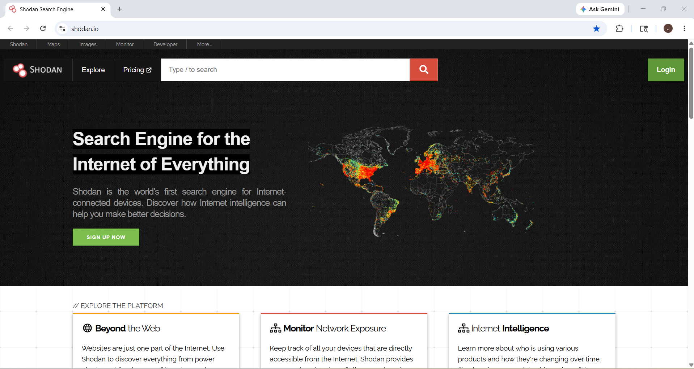
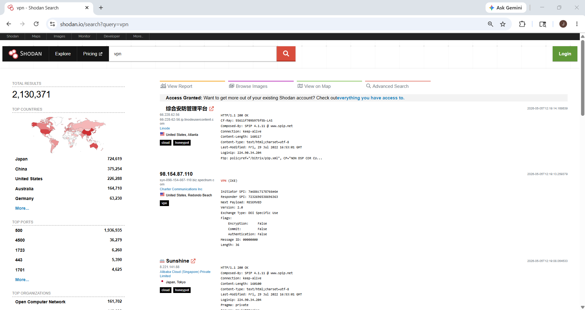
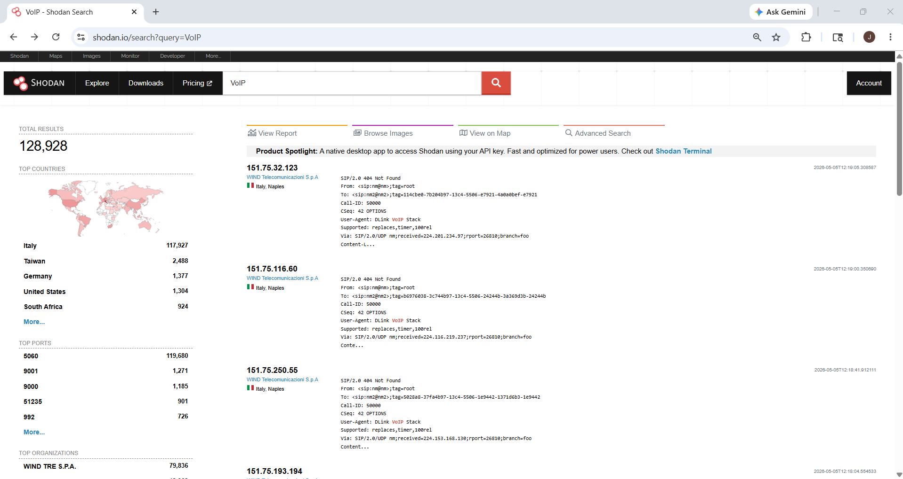
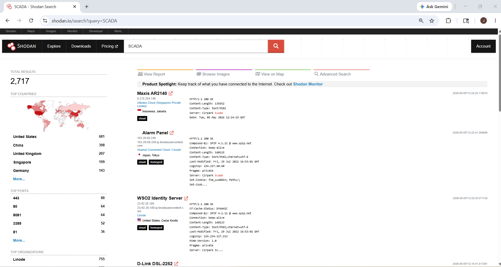
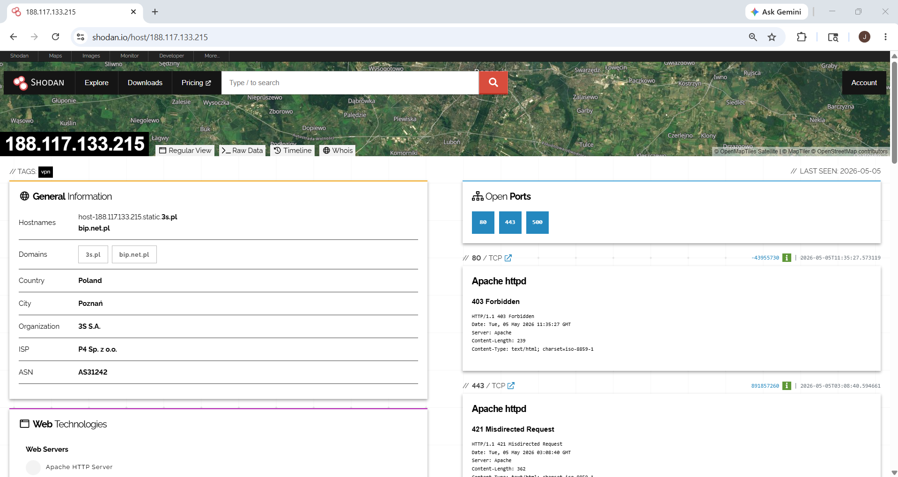

# Footprinting Through SHODAN Search Engine

## 1. Overview

**Shodan** is a search engine used to discover internet-connected devices.

Unlike Google, which searches websites and pages, Shodan searches:

- servers
- routers
- webcams
- VPN gateways
- IoT devices
- industrial systems
- exposed services
- open ports
- public banners

This makes Shodan useful for finding publicly exposed devices and services connected to the internet.

Official website:
https://www.shodan.io

---

## 2. Why Shodan Matters

Shodan is important because it helps security professionals understand what devices and services are publicly visible on the internet.

It is commonly used for:

- asset discovery
- external attack surface mapping
- exposed service detection
- open port discovery
- IoT visibility
- industrial system exposure checks
- public infrastructure review

Instead of searching websites, Shodan searches exposed internet-facing systems.

---

## 3. How Shodan Works

Shodan continuously scans the internet and collects data from publicly reachable devices.

When Shodan finds a device, it stores information such as:

- IP address
- open ports
- service banners
- software details
- protocol information
- SSL details
- geolocation
- organization
- ISP
- hostnames

This allows users to search devices based on exposed service data.

In simple words:

> Google finds websites.
> Shodan finds internet-connected devices and services.

---

## 4. What Shodan Can Find

Shodan can help identify publicly visible:

- web servers
- VPN gateways
- VoIP servers
- routers
- firewalls
- webcams
- NAS devices
- IoT devices
- SCADA / ICS systems
- industrial devices
- exposed admin panels
- open databases
- remote desktop services

---

## 5. What Information Shodan Shows

For a discovered host, Shodan may show:

- IP address
- hostname
- country
- city
- ISP
- organization
- ASN
- open ports
- protocols
- software banners
- service version
- SSL certificate details
- HTTP headers
- technology stack

This helps identify what is publicly exposed.

---

## 6. How to Access Shodan

### Official Website
https://www.shodan.io

text

### Steps

1. Open browser
2. Go to Shodan
3. Use the search bar
4. Search by keyword, service, or technology
5. Review results

---

## 7. Understanding the Shodan Interface

The Shodan search page includes:

- **Search bar** → search for devices/services
- **Results panel** → matching hosts
- **Filters** → narrow search
- **Host details** → open ports, banners, services
- **Map view** → geographic results

This helps quickly analyze exposed assets.

---

## 8. How to Use Shodan (Step-by-Step)

### Step 1: Open Shodan

Go to:
https://www.shodan.io

text

### Step 2: Enter a Search Query

Search for a service or technology such as:

- vpn
- apache
- nginx
- webcam
- mysql
- ftp
- SCADA
- VoIP

This tells Shodan what type of exposed service to search for.

### Step 3: Review Results

Shodan returns matching internet-facing systems.

Each result may show:

- IP address
- country
- open port
- service type
- software banner
- organization

### Step 4: Open a Host

Click a result to open detailed host information.

This shows:

- host summary
- open ports
- running services
- software banners
- SSL info
- technologies
- vulnerabilities (if visible)

### Step 5: Analyze Exposure

Review the host carefully.

Check:

- what ports are open
- what services are exposed
- what software is running
- what technologies are visible
- whether the service should be public

---

## 9. Basic Shodan Search Examples

### 9.1 Search VPN Devices
vpn

text

**Use:** Finds publicly visible VPN-related services.

### 9.2 Search VoIP Services
VoIP

text

**Use:** Finds internet-facing VoIP systems.

### 9.3 Search SCADA Systems
SCADA

text

**Use:** Finds industrial control related systems.

### 9.4 Search Web Servers
apache

text

**Use:** Finds systems exposing Apache server banners.

### 9.5 Search Open Webcam Devices
webcam

text

**Use:** Finds publicly visible webcam-related systems.

---

## 10. Practical Example 1: Finding VPN Services

### Query
vpn

text

### What it does
Searches for internet-facing VPN-related services.

### What you may see
- VPN gateways
- remote access portals
- VPN protocols
- public VPN endpoints

### Security Use
Useful for checking exposed remote access infrastructure.

---

## 11. Practical Example 2: Finding VoIP Services

### Query
VoIP

text

### What it does
Searches for public VoIP-related systems.

### What you may see
- SIP services
- VoIP gateways
- telecom systems

### Security Use
Useful for telecom exposure analysis.

---

## 12. Practical Example 3: Finding SCADA / ICS Systems

### Query
SCADA

text

### What it does
Searches for publicly visible industrial systems.

### What you may see
- industrial interfaces
- control systems
- SCADA panels
- exposed ICS services

### Security Use
Useful for industrial exposure checks.

---

## 13. Understanding Host Details

When opening a host in Shodan, check these sections:

### Open Ports
Shows exposed ports such as:
- 80 (HTTP)
- 443 (HTTPS)
- 22 (SSH)
- 21 (FTP)
- 3389 (RDP)

Useful for identifying exposed services.

### Services / Banners
Shows what service is running and what it reveals.

Examples:
- Apache
- Nginx
- OpenSSH
- Fortinet
- Cisco ASA

### Organization / ISP
Shows who owns or hosts the system.

### Web Technologies
Shows detected technologies such as:
- jQuery
- Apache
- PHP
- nginx

---

## 14. Security Use Cases

Shodan is commonly used for:

- external attack surface mapping
- internet exposure review
- asset discovery
- open port detection
- service fingerprinting
- VPN exposure checks
- IoT discovery
- industrial system visibility
- security auditing

---

## 15. Risks / Misuse

Attackers may misuse Shodan to identify:

- exposed services
- weak devices
- open admin panels
- vulnerable systems
- public infrastructure

This is why defenders use Shodan first—to find and secure exposure before attackers do.

---

## 16. Ethical Note

Use Shodan only for:

- education
- authorized testing
- defensive security
- exposure assessment
- security auditing

Do not use it for:

- unauthorized access
- exploitation
- illegal scanning
- privacy violation

---

## 17. Key Takeaways

- Shodan is a search engine for internet-connected devices
- It finds exposed public systems and services
- It is useful for asset discovery and exposure review
- It helps identify open ports, services, and technologies
- It is widely used in security assessments and attack surface analysis
- It should only be used ethically and on authorized targets
