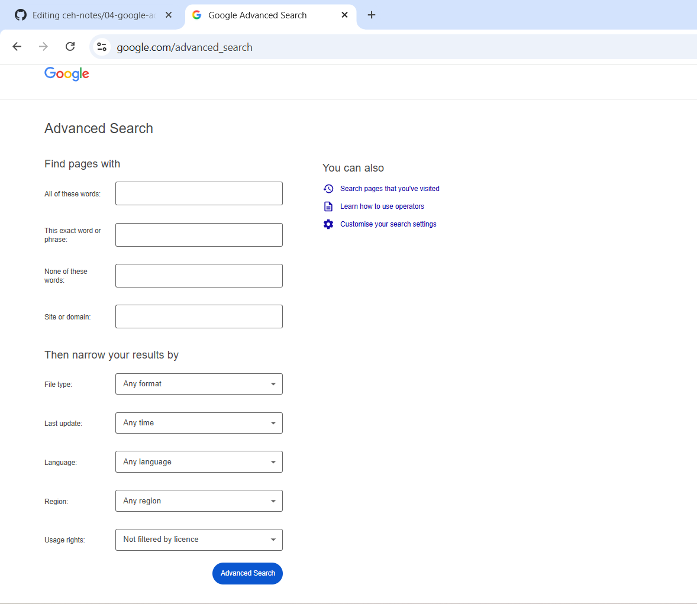
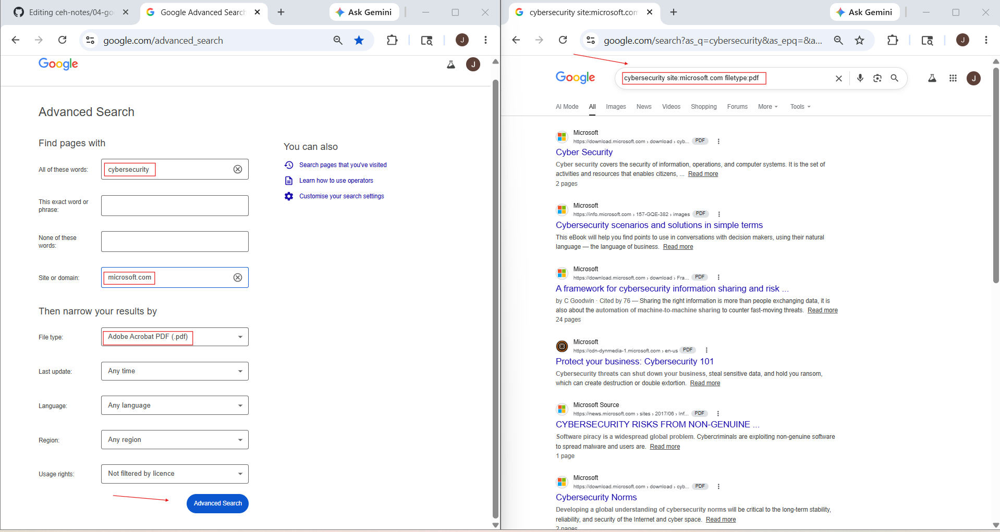

# Gathering Information Using Google Advanced Search

## 1. Overview

**Google Advanced Search** is Google's built-in search form that helps you search more precisely without manually typing advanced operators like `site:`, `filetype:`, or `intitle:`.

Instead of writing search operators manually, Google provides fields where you can enter:

- exact words
- exact phrases
- excluded words
- domain names
- file types
- language
- region
- update time

This makes searching easier, cleaner, and more structured.

---

## 2. Why It Matters

Normal Google search gives broad results.

Google Advanced Search helps narrow results and makes searches more accurate.

It is useful when you want to:

- find exact information
- reduce irrelevant results
- search inside one website
- find specific file types
- filter by region or language
- collect public information faster

This is useful in:

- OSINT
- Footprinting
- Reconnaissance
- Content discovery
- Exposure checking

---

## 3. How It Works

Google Advanced Search works like a visual version of Google operators.

### Instead of typing: cybersecurity site:microsoft.com filetype:pdf

you fill fields like:

- site/domain = microsoft.com
- all these words = cybersecurity
- file type = PDF

Google automatically builds the search query in the background.

So this is basically:

> Advanced Search = Google operators without remembering operator syntax

---

## 4. How to Access Google Advanced Search

### Official URL
https://www.google.com/advanced_search

text

### Steps

1. Open browser
2. Go to Google Advanced Search
3. Fill the search fields
4. Click **Advanced Search**
5. Review filtered results

---

## 5. Understanding the Interface

Google Advanced Search includes these main fields:

### Search Fields

| Field | Description |
|-------|-------------|
| **all these words** | all words must appear |
| **this exact word or phrase** | exact phrase match |
| **any of these words** | any one can appear |
| **none of these words** | exclude words |
| **numbers ranging from** | numeric range |

### Filter Fields

- language
- region
- last update
- site or domain
- terms appearing
- file type
- usage rights

These fields help narrow results without writing manual operators.

---
