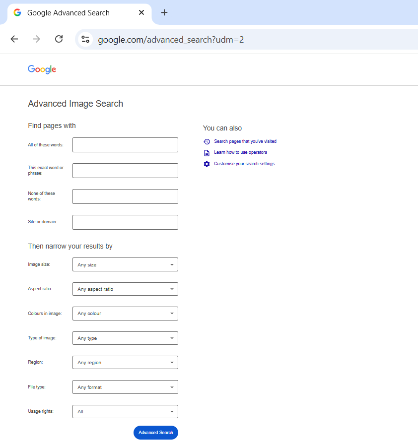
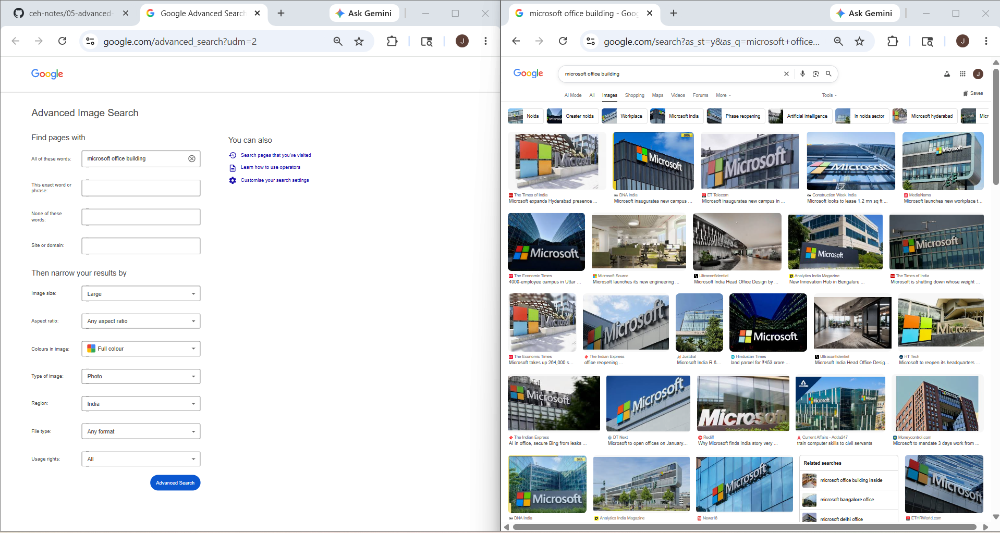

# Advanced Image Search

## 1. Overview

**Advanced Image Search** is a Google search feature used to find images more precisely by applying filters.

Instead of doing a normal image search, Advanced Image Search lets you narrow results using:

- exact words
- image size
- color
- image type
- file type
- domain
- region
- usage rights

This helps you find more specific and useful images.

---

## 2. Why It Matters

Normal image search gives too many mixed results.

Advanced Image Search helps filter results and find only relevant images.

In cybersecurity, this is useful for finding:

- company office images
- employee photos
- event photos
- logos and branding
- building images
- data center images
- leaked screenshots
- infrastructure-related visuals

This makes it useful in:

- OSINT
- Footprinting
- Reconnaissance
- Social engineering research
- Brand investigation

---

## 3. How It Works

Google stores indexed images from websites.

Advanced Image Search applies filters to reduce irrelevant results and return only matching images.

Instead of searching all images, you tell Google:

- what image to find
- where to search
- what type of image to return

This makes image searching more accurate.

---

## 4. How to Access Advanced Image Search

### Official URL 
https://www.google.com/advanced_image_search

text

### Steps

1. Open browser
2. Go to Google Advanced Image Search
3. Fill the search fields
4. Apply filters
5. Click Advanced Search

---

## 5. How to Use Advanced Image Search

### Step 1: Open Advanced Image Search

Open: https://www.google.com/advanced_image_search

You will see the Advanced Image Search page.

### Step 2: Enter Search Keywords

In the search fields, enter what image you want to find.

Example:
- microsoft office
- tesla data center
- amazon warehouse
- apple campus

### Step 3: Apply Filters

Now narrow results using filters.

You can filter by:
- image size
- aspect ratio
- color
- image type
- region
- site/domain
- file type

### Step 4: Click Advanced Search

Click **Advanced Search**.

Google returns filtered image results based on your settings.

### Step 5: Analyze Results

Review the images carefully.

Look for:
- office locations
- employee photos
- public events
- company branding
- infrastructure visuals
- screenshots
- public facilities

---

## 6. Important Filters in Advanced Image Search

### 6.1 All These Words

Finds images related to all entered words.

**Example:** `microsoft office`

Useful for finding office-related images.

### 6.2 Exact Word or Phrase

Finds images matching the exact phrase.

**Example:** `"microsoft campus"`

Useful for precise image matching.

### 6.3 Image Size

Filters by image size.

Useful for finding:
- large clear images
- banners
- high-resolution photos

### 6.4 Aspect Ratio

Filters by image shape.

Useful for finding:
- wide images
- tall images
- square images

### 6.5 Color

Filters by image color.

Useful for finding:
- full-color images
- black & white images
- transparent images

### 6.6 Type of Image

Filters by image type.

Examples:
- face
- photo
- clip art
- line drawing
- animated

### 6.7 Region

Filters images by country/region.

Useful for location-based research.

### 6.8 Site or Domain

Search images only from one website.

**Example:** `microsoft site:microsoft.com`

### 6.9 File Type

Filters by image format.

Examples:
- JPG
- PNG
- GIF
- SVG

---
## Example: Finding Company Office Images

### Goal
Find public images of Microsoft office buildings around the world.

### Step 1: Open Advanced Image Search

Go to: https://www.google.com/advanced_image_search

### Step 2: Enter Search Query

In "all these words" field, type:
microsoft office building

### Step 3: Apply Filters

| Filter | Selection |
|--------|-----------|
| Image size | Large |
| Type of image | Photo |
| Color | Full color |
| Region | Any (or select specific country) |

### Step 4: Click Advanced Search

Click the **Advanced Search** button.

### Step 5: Analyze Results

Google returns filtered images showing:
- Microsoft office buildings from different countries
- Building entrances and exteriors
- Company logos on buildings
- Surrounding areas and streets
- Security features (if visible)

### Example Results You May See

| Location | What Images Show |
|----------|------------------|
| Redmond, USA | Microsoft Headquarters campus |
| Hyderabad, India | Microsoft India Development Center |
| London, UK | Microsoft London office |
| Sydney, Australia | Microsoft Sydney office |

### Security Implications

These publicly available images can reveal:
- Exact office locations
- Building access points
- Security measures
- Employee entry/exit patterns
- Adjacent vulnerable areas

