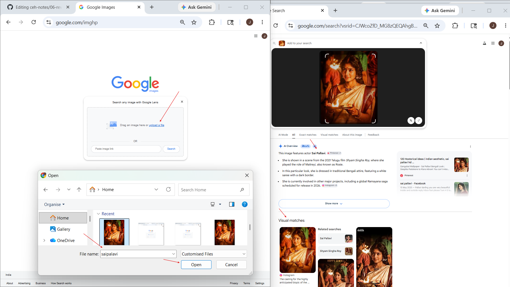

# Reverse Image Search

## 1. Overview

**Reverse Image Search** is a technique where an image is used as the search query instead of text.

Instead of typing keywords, you:

- upload an image
- paste an image URL
- drag and drop an image

Google then searches the internet for matching or similar images.

This helps identify:

- where the image appears online
- original source of the image
- similar images
- edited versions
- fake or reused images

---

## 2. Why It Matters

Reverse Image Search is useful because images often contain hidden information.

In cybersecurity and OSINT, it helps identify:

- fake profiles
- stolen profile pictures
- company employee images
- reused images
- scam accounts
- social media identity reuse
- image origin
- public appearances of a person or object

This makes it useful in:

- OSINT
- Footprinting
- Social engineering investigations
- Identity verification
- Scam detection

---

## 3. How Reverse Image Search Works

Google compares the uploaded image with billions of indexed images.

It analyzes:

- image patterns
- objects
- colors
- faces
- shapes
- text inside images

Then it returns:

- matching images
- visually similar images
- websites containing the image
- possible original sources

In simple words:

> Instead of searching with text, you search using an image.

---

## 4. How to Access Reverse Image Search

### Official URL https://www.google.com/imghp

### Steps to Access

1. Open Google Images
2. Click the Google Lens / camera icon
3. Upload or paste image URL
4. Start search

---

## 5.Example: Reverse Image Search Demonstration

### Image Used

Public celebrity image for demonstration purposes only.

### Purpose

To demonstrate how Reverse Image Search identifies visually similar and matching images online.

### Steps Performed

1. Opened Google Images
2. Clicked the Google Lens (camera) icon
3. Uploaded a public celebrity photo
4. Google searched for matching images
5. Analyzed the results returned by Google

### Results Returned

Google returned:

- related images
- matching websites
- news pages
- social media references
- image source pages

### Learning Outcome

Reverse Image Search can help verify:
- image authenticity
- image reuse
- original source
- online usage of an image

---

## 6. What Reverse Image Search Can Identify

Reverse Image Search can help identify:

- fake profile pictures
- reused images
- image origin
- edited versions
- social media reuse
- public appearances
- meme sources
- website usage
- copied content

---

## 7. How to Analyze Results

When results appear, check:

### Exact Matches
Shows websites using the same image. Useful for identifying reuse.

### Similar Images
Shows visually related images. Useful for identifying variations or edits.

### Website Sources
Shows where the image is published online. Useful for source tracking.

### Search Suggestions
Shows related keywords detected from the image. Useful for additional OSINT.

---

## 10. Other Reverse Image Search Tools

Besides Google, common reverse image search tools include:

| Tool | URL |
|------|-----|
| Google Images | images.google.com |
| TinEye | tineye.com |
| Bing Visual Search | bing.com/visualsearch |
| Yandex Images | yandex.com/images |
| Pinterest Visual Search | pinterest.com |

Each tool may return different results.

---

## 11. Security Use Cases

Security professionals use Reverse Image Search for:

- OSINT
- fake account detection
- identity verification
- scam analysis
- social engineering investigations
- brand monitoring
- visual intelligence gathering

---

