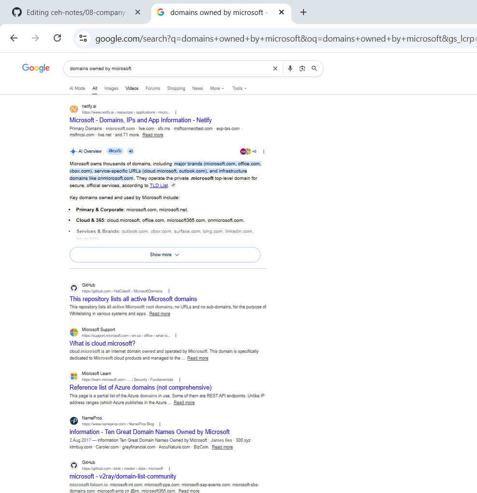

# Finding Company Domains using Search Engines

## 1. Overview

Organizations often own multiple domains and websites.

Using search engines, we can identify:

- company domains
- public websites
- related business sites
- regional domains
- service portals
- support websites

This process is called:

> **Finding Company Domains using Search Engines**

It is part of:

- Footprinting
- Reconnaissance
- OSINT

---

## 2. Why It Matters

A company may have many public domains besides its main website.

Example:

A company may own:

- main website
- support portal
- developer portal
- cloud platform
- regional websites
- testing sites
- mobile app domains

Finding these domains helps understand:

- company infrastructure
- internet presence
- public attack surface
- business units
- external services

---

## 3. What is a Domain?

A **domain** is the public website address of an organization.

Example:
microsoft.com

Other examples:
google.com
amazon.com
tesla.com

Domains help users access websites on the internet.

---

## 4. What is a TLD (Top-Level Domain)?

The **TLD** is the last part of a domain name.

Examples:

| Domain             | TLD    |
| ------------------ | ------ |
| microsoft.com      | `.com` |
| iiitkottayam.ac.in | `.in`  |
| gov.in             | `.in`  |
| wikipedia.org      | `.org` |

Common TLDs:

- `.com`
- `.org`
- `.net`
- `.edu`
- `.gov`
- `.in`

---

## 5. How Search Engines Help

Search engines index public websites and domains.

By searching carefully, we can discover:

- company-owned domains
- related websites
- support portals
- partner sites
- archived pages
- developer resources

Search engines commonly used:

- Google
- Bing

---

## 6. Example

### Goal
Find Microsoft-related public domains.

### Search Query
domains owned by microsoft

### What You May Find

- microsoft.com
- support.microsoft.com
- learn.microsoft.com
- azure.microsoft.com

### Security Use
Useful for:
- attack surface visibility
- infrastructure mapping
- public asset discovery

---

