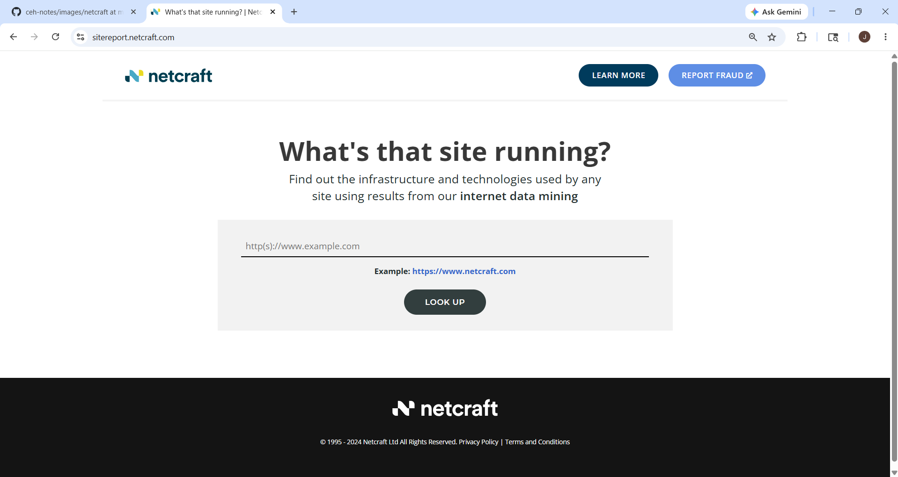

# Netcraft

## 1. Overview

**Netcraft** is an internet reconnaissance and cybersecurity information-gathering platform used to collect public information about websites, domains, servers, hosting providers, technologies, and infrastructure.

Official Website:
Official Website:
https://www.netcraft.com

Netcraft is widely used in:

- OSINT
- Footprinting
- Reconnaissance
- Attack Surface Mapping
- Website Technology Discovery

It helps identify publicly available information related to internet-facing assets.

---

## 2. Why Netcraft Matters

Organizations expose a lot of information on the internet.

Netcraft helps identify:

- subdomains
- hosting providers
- IP addresses
- technologies used
- operating systems
- web servers
- SSL certificate details
- historical information

This helps security professionals understand:

- company infrastructure
- internet exposure
- public attack surface
- technologies used by a target

---

## 3. How Netcraft Works

Netcraft collects internet-facing information by:

- scanning websites
- analyzing servers
- monitoring SSL certificates
- identifying technologies
- collecting DNS information
- tracking hosting infrastructure

When you search a domain, Netcraft displays publicly available infrastructure information about that target.

---

## 4. Main Features of Netcraft

### 4.1 Site Report

This is the most important feature.

It shows detailed information about a target website such as:

- IP address
- hosting provider
- operating system
- server technology
- SSL details
- DNS information

### 4.2 Technology Detection

Netcraft identifies technologies used by websites.

Examples:
- Apache
- nginx
- PHP
- WordPress
- Cloudflare

### 4.3 Hosting Information

Shows where a website is hosted.

Examples:
- AWS
- Azure
- Cloudflare
- DigitalOcean

### 4.4 SSL Certificate Information

Shows certificate-related information such as:
- issuer
- validity
- certificate details

### 4.5 Historical Data

Sometimes Netcraft provides historical information such as:
- previous hosting
- older server technologies
- infrastructure changes

---

## 6. How to Access Netcraft

### Official Website
https://www.netcraft.com

### Site Report Direct Link
https://sitereport.netcraft.com

---

## 7. How to Use Netcraft

### Step 1: Open Netcraft Site Report

Open:
https://sitereport.netcraft.com

### Step 2: Enter Target Domain

Enter a domain name.

Example:
microsoft.com

### Step 3: Start Search

Click search.

Netcraft generates a Site Report for the target.

### Step 4: Analyze Site Report

The Site Report may show:
- site title
- IP address
- country
- hosting provider
- web server
- operating system
- SSL information
- DNS details

### Step 5: Identify Technologies

Check the technologies used by the website.

Examples:
- Apache
- nginx
- PHP
- ASP.NET
- Cloudflare

### Step 6: Review Hosting Information

Check:
- hosting provider
- cloud platform
- ISP
- server location

### Step 7: Review SSL Information

Check SSL certificate details such as:
- issuer
- expiration
- certificate authority

### Step 8: Record Findings

Document useful information.

Example:

| Information | Value           |
| ----------- | --------------- |
| Domain      | microsoft.com   |
| Hosting     | Microsoft Azure |
| Server      | nginx           |
| SSL         | Valid           |
| Country     | US              |

---

## 8. Practical Example

### Goal
Collect public infrastructure information about Microsoft.

### Target
microsoft.com

### Steps
1. Open Netcraft Site Report
2. Enter `microsoft.com`
3. Start search
4. Review report details

### Information You May Find
- hosting provider
- server technology
- IP address
- SSL details
- operating system
- DNS information

### Security Use
Useful for:
- reconnaissance
- infrastructure mapping
- technology fingerprinting
- exposure analysis

---

## 9. Advantages of Netcraft

- Easy to use
- Good for reconnaissance
- Provides infrastructure visibility
- Helps identify technologies
- Useful for attack surface analysis
- Useful in OSINT investigations

---

## 10. Limitations of Netcraft

- Only public information is visible
- Some data may change frequently
- Not all technologies are always detected accurately

---
