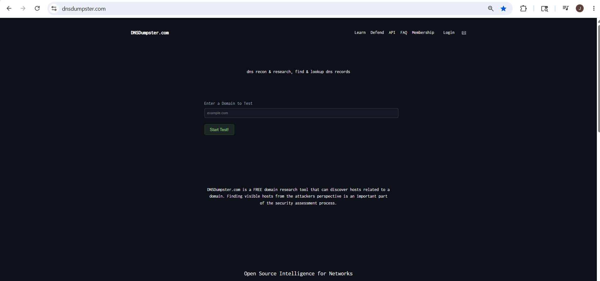
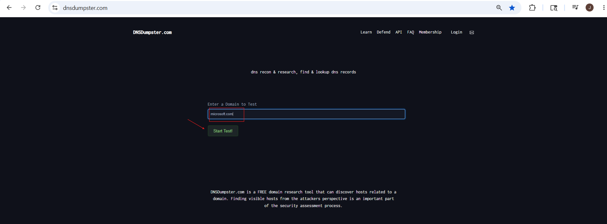
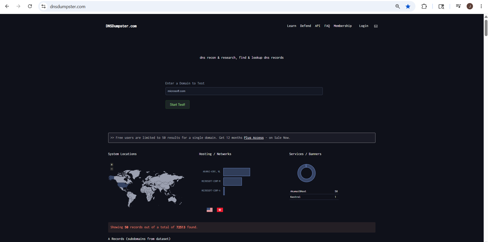
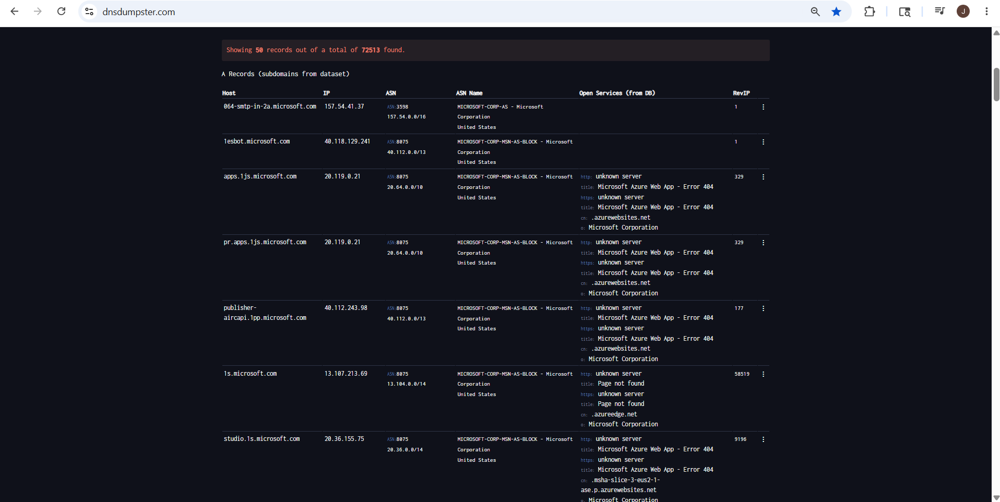
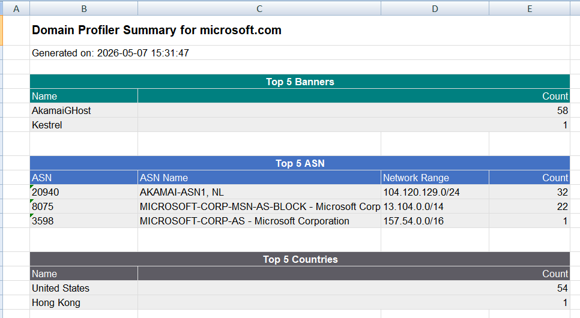

# DNSDumpster — DNS Reconnaissance and Subdomain Enumeration

## 1. Overview

**DNSDumpster** is an online OSINT and reconnaissance tool used to gather public DNS-related information about a target domain.
Official Website:
https://dnsdumpster.com

DNSDumpster helps identify:

- subdomains
- DNS records
- mail servers
- nameservers
- public IP addresses
- infrastructure relationships

It is commonly used in:

- Footprinting
- Reconnaissance
- OSINT
- Attack Surface Mapping
- Infrastructure Analysis

---

## 2. Why DNSDumpster Is Important

Organizations expose many services publicly on the internet.

DNSDumpster helps security professionals understand:

- what systems are publicly visible
- what subdomains exist
- what email infrastructure is used
- what DNS servers are configured
- how external infrastructure is connected

This helps identify the public attack surface of an organization.

---

## 3. What is DNS Enumeration?

DNS Enumeration means collecting DNS-related information about a target domain.

This may include:

- subdomains
- IP addresses
- MX records
- NS records
- TXT records
- public hosts

DNSDumpster automates this process and shows results in a structured format.

---

## 4. Understanding Important DNS Records

Before using DNSDumpster, it is important to understand basic DNS records.

### 4.1 A Record

Maps a domain to an IP address.

**Example:** `example.com → 192.168.x.x`

**Purpose:** Used to identify where the website/server is hosted.

### 4.2 MX Record

Shows the mail server used by the domain.

**Example:** `mail.example.com`

**Purpose:** Used to identify email infrastructure.

### 4.3 NS Record

Shows authoritative nameservers for the domain.

**Example:** `ns1.example.com`

**Purpose:** Used to identify DNS infrastructure.

### 4.4 TXT Record

Stores text-based information. Commonly used for SPF, domain verification, and email security policies.

---

## 5. What DNSDumpster Can Find

DNSDumpster can identify:

| Information Type | Example |
| ---------------- | ------- |
| Subdomains | support.microsoft.com |
| Mail Servers | outlook.office365.com |
| Nameservers | ns1.microsoft.com |
| Public Hosts | login.microsoft.com |
| IP Addresses | 20.x.x.x |
| TXT Records | SPF records |

---

## 6. How DNSDumpster Works

When a domain is entered:

1. DNSDumpster queries public DNS information
2. Collects subdomains and host records
3. Identifies mail servers and nameservers
4. Maps infrastructure relationships
5. Displays the results visually

It only collects publicly available information.

---

## 7. How to Use DNSDumpster 

### Step 1: Open DNSDumpster

Open:
https://dnsdumpster.com

### Step 2: Enter Target Domain

Enter the target domain.

**Example:** `microsoft.com`

### Step 3: Start Search

Click the search button. DNSDumpster starts collecting DNS information.

### Step 4: Review Subdomains

DNSDumpster shows discovered public subdomains.

**Example Results:**
- support.microsoft.com
- admin.microsoft.com
- login.microsoft.com

### Step5 : Analyze DNS Records

DNSDumpster displays:
- A records (Public IP addresses)
- MX records (Email infrastructure)
- NS records (Nameservers)
- TXT records (SPF and verification)

#### DNSDumpster - Domain Profiler Summary

After the DNS enumeration, DNSDumpster provides a **Domain Profiler Summary** showing additional infrastructure insights.

### Step 7: Review Network Map

DNSDumpster generates a visual network map showing relationships between domains, subdomains, and DNS servers.

### Step 8: Document Findings

Record important discovered information.

| Information | Value |
| ----------- | ----- |
| Domain | microsoft.com |
| Subdomain | admin.microsoft.com |
| MX Server | outlook.office365.com |
| Nameserver | ns1.microsoft.com |

---

## 8. Practical Example — Microsoft Domain Enumeration

### Goal
Discover public DNS infrastructure related to Microsoft.

### Tool Used
DNSDumpster

### Target
microsoft.com

text

### Steps Performed
1. Opened DNSDumpster
2. Entered target domain
3. Completed CAPTCHA
4. Started DNS enumeration
5. Reviewed discovered subdomains
6. Analyzed DNS records
7. Reviewed network map

### Information Discovered

**Subdomains:**
support.microsoft.com
admin.microsoft.com
login.microsoft.com

text

**MX Records:**
outlook.office365.com

text

**Nameservers:**
ns1.microsoft.com

text

### Security Value

This demonstrates how DNS enumeration helps identify:
- public-facing infrastructure
- mail systems
- DNS configuration
- external attack surface

### Learning Outcome

Using DNSDumpster helped understand:
- DNS enumeration
- subdomain discovery
- infrastructure mapping
- attack surface visibility

---

## 9. Advantages of DNSDumpster

- Easy to use
- Good for beginners
- Visual infrastructure mapping
- Fast DNS enumeration
- Useful for OSINT and reconnaissance

---

## 10. Limitations

- Only public information is visible
- Hidden/internal systems are not shown
- Results depend on public DNS exposure

---

## 11. Risks / Misuse

Attackers may use DNS enumeration to identify:
- exposed infrastructure
- forgotten services
- weak attack surfaces
- public-facing systems

This is why organizations monitor public DNS exposure carefully.

---

