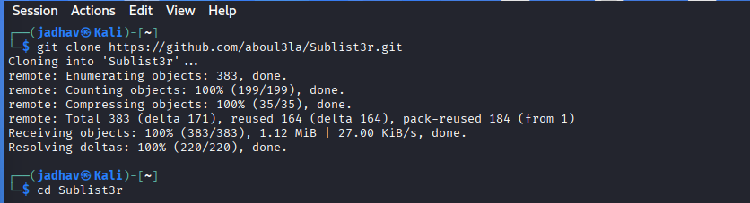
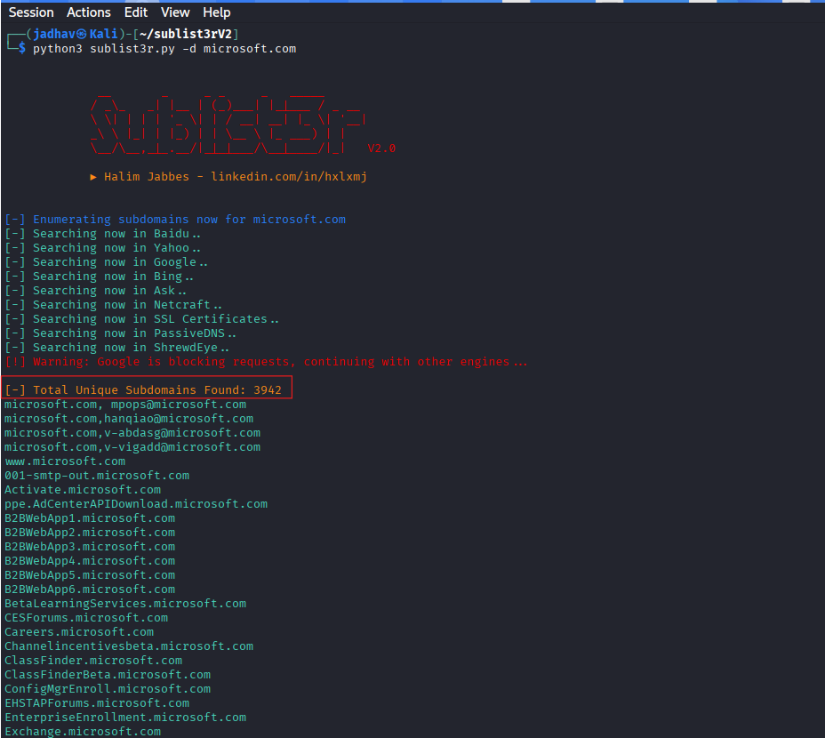
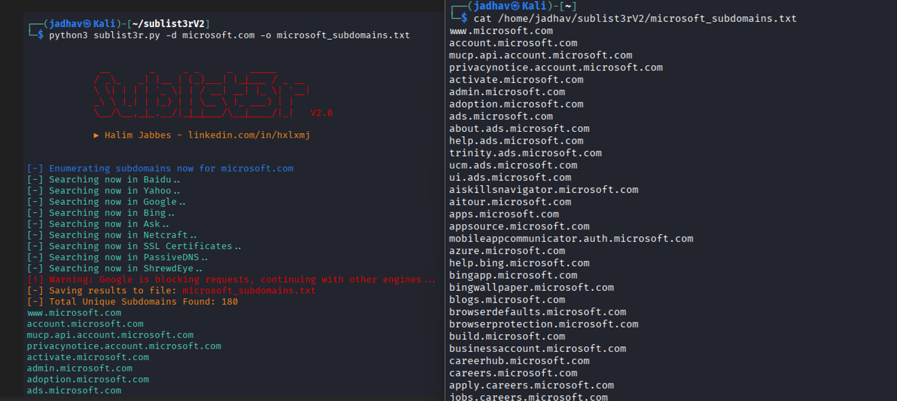

# Sublist3r — Subdomain Enumeration Tool

## 1. Overview

**Sublist3r** is an OSINT and reconnaissance tool used to discover subdomains of a target domain.

It is commonly used during:

- Footprinting
- Reconnaissance
- Bug bounty hunting
- VAPT
- Attack Surface Mapping

Sublist3r automates subdomain discovery using public search engines and OSINT sources.

---

## 2. What is Subdomain Enumeration?

Subdomain Enumeration means identifying subdomains related to a target domain.

Example:
Main domain:microsoft.com

- Possible subdomains:
- support.microsoft.com
- admin.microsoft.com
- learn.microsoft.com
- api.microsoft.com

Organizations use subdomains for:

- login systems
- APIs
- support portals
- admin panels
- testing systems
- cloud services

Finding these subdomains helps understand the public attack surface.

---

## 3. Why Sublist3r Is Important

Manually finding subdomains is slow and incomplete.

Sublist3r automates this process and searches multiple public sources to discover subdomains quickly.

It helps identify:

- public services
- exposed systems
- forgotten hosts
- testing environments
- APIs
- cloud-related services

This makes it valuable in cybersecurity reconnaissance.

---

## 4. What Sublist3r Uses Internally

Sublist3r gathers subdomains from public sources such as:

- Google
- Bing
- Yahoo
- Baidu
- Ask
- Netcraft
- VirusTotal
- ThreatCrowd
- DNSdumpster

It collects publicly available information only.

---

## 5. Installing Sublist3r

### Step 1 — Open Terminal

Open terminal in Kali Linux.

### Step 2 — Clone Sublist3r

Run:
```bash
git clone https://github.com/aboul3la/Sublist3r.git
```
### Step 3 — Move into Directory
```bash
cd Sublist3r
```

### 6. Basic Sublist3r Syntax
Basic command:

```bash
python3 sublist3r.py -d target.com
```
#### Understanding the Command
- python3	Runs Python
- sublist3r.py	Tool script
- -d	Target domain
- target.com	Domain to enumerate
### 7. Basic Example
Example:

```bash
python3 sublist3r.py -d microsoft.com
```
What This Does
Sublist3r searches public sources for subdomains related to microsoft.com.




### 8. Saving Results to a File
Command:

```bash
python3 sublist3r.py -d microsoft.com -o microsoft_subdomains.txt
```
Understanding the
Parameter	Purpose
-o	Output file
microsoft_subdomains.txt	Save results
What This Does
Discovers subdomains

Saves results into a text file

Useful for documentation and further analysis.




