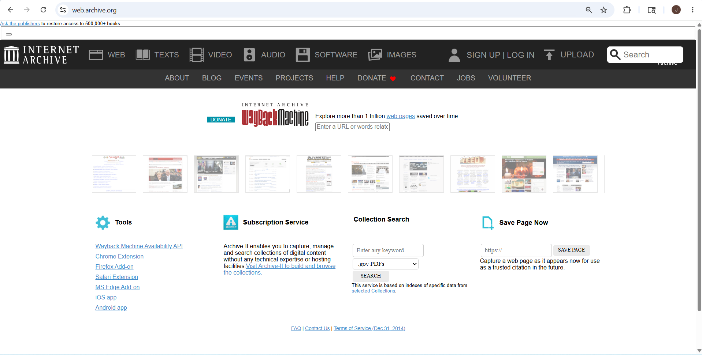
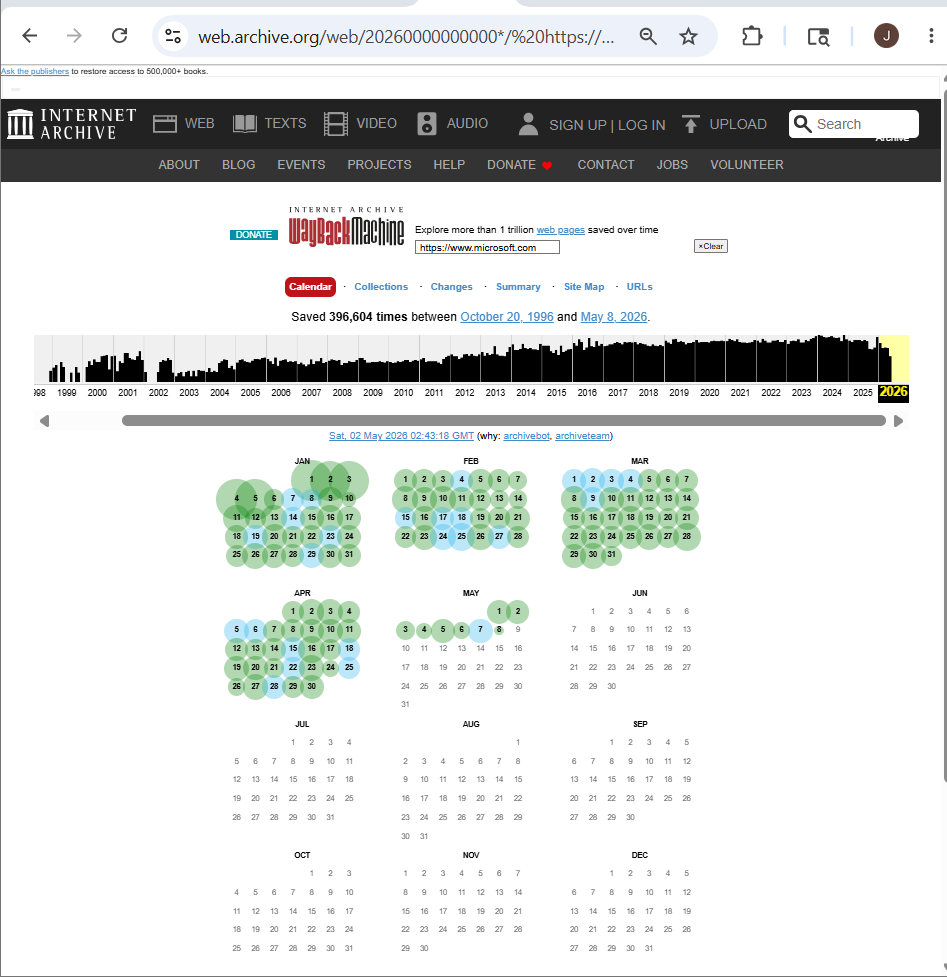
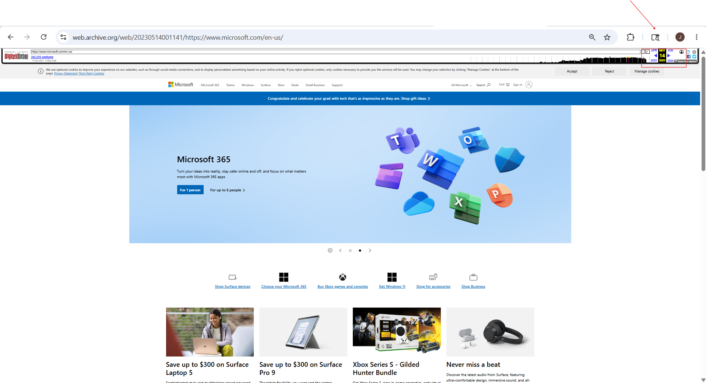
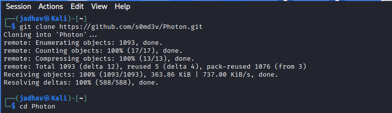
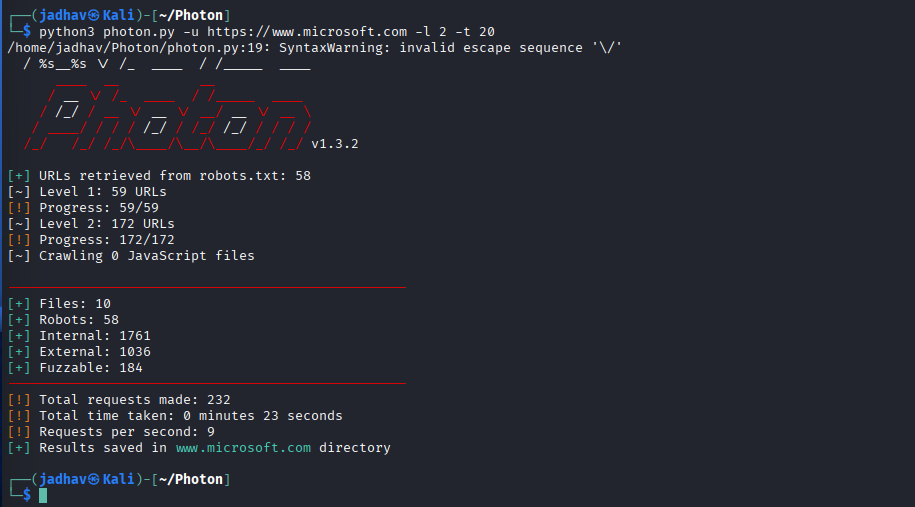

# Extracting Website Information from archive.org

## Overview

The Internet Archive Wayback Machine allows users to view archived versions of websites from different time periods. During reconnaissance, archived data can help identify old pages, removed content, historical URLs, and exposed resources that may no longer exist on the live website.

The Wayback Machine stores snapshots of websites over time, making it useful for understanding how a target website changed historically.

---

## What is archive.org?

`archive.org` is a digital archive that stores historical versions of websites.

### Website
https://archive.org

### Wayback Machine
https://web.archive.org

The Wayback Machine allows users to:

- View old versions of websites
- Access archived web pages
- Analyze removed content
- Discover historical URLs

---

## Why Archived Information Matters

Archived pages may contain:

- Old login pages
- Removed directories
- Old JavaScript files
- Exposed documents
- Contact details
- API endpoints
- Technology information

During reconnaissance, this information helps researchers understand the target website structure and history.

---

## Basic Usage of the Wayback Machine

### Step 1 — Open the Wayback Machine
https://web.archive.org




---

### Step 2 — Enter the Target Website && View Archived Snapshots

Example:
https://www.microsoft.com

##### The calendar view displays:

- Archived dates
- Snapshot frequency
- Historical versions of the website

Users can click highlighted dates to open archived versions.



---

### Step 3— Open an Archived Web Page

Selecting a saved date loads the archived website version from that time period.



---

## Information That Can Be Collected

Archived pages may reveal:

- Hidden paths
- Old URLs
- Removed pages
- Public files
- Technology stack details
- Historical website structure

This information is useful during the reconnaissance phase of security testing.

---

## Using Photon to Retrieve Archived URLs

Photon is an OSINT and reconnaissance tool that can collect archived URLs from the Wayback Machine.

### Clone Photon Repository

```bash
git clone https://github.com/s0md3v/Photon.git
```
Move Into the Directory
```bash
cd Photon
```




### Retrieving archive.org Links

``` bash
python3 photon.py -u https://example.com -l 3 -t 200 --wayback
```
### Explanation
Option	Meaning
- -u	Target URL
- -l 3	Crawl depth
- -t 200	Number of threads
- --wayback	Retrieve archived URLs from archive.org
### Example
```bash
python3 photon.py -u https://www.microsoft.com -l 2 -t 20 --wayback
```




