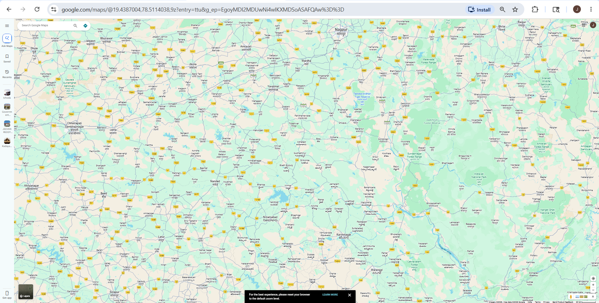
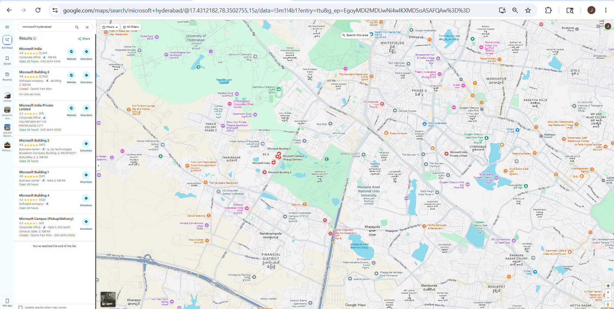
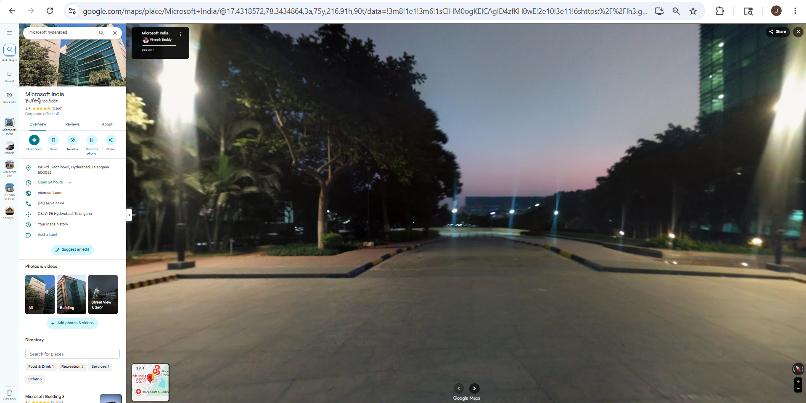
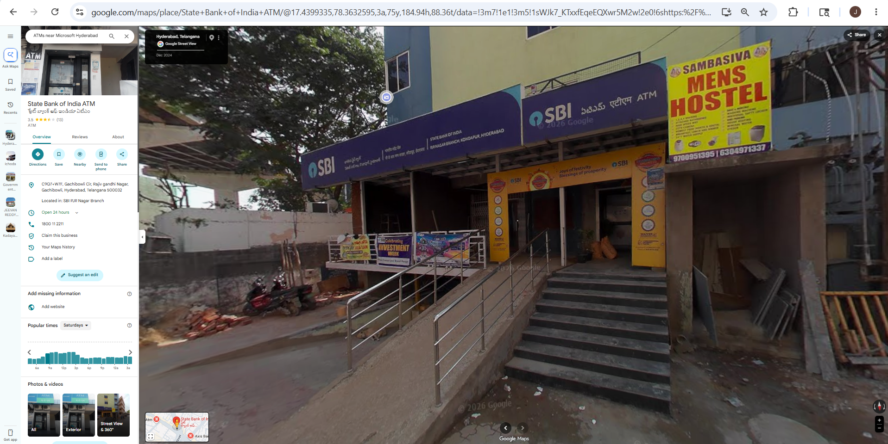

# Google Maps – Footprinting & Reconnaissance

## 1. Overview

**Google Maps** is a geographical intelligence tool used to gather public information about a target location, company, or organization.

In cybersecurity and OSINT, it is used during the **footprinting phase** to collect location-based information without directly interacting with the target.

---

## 2. Official Website
https://maps.google.com

---

## 3. Why Security Researchers Use Google Maps

Google Maps is valuable for OSINT because it helps:

- Identify company locations
- View office buildings
- Find nearby places
- Analyze surroundings
- Observe roads and entry points
- Gather public business information

---

## 4. Information That Can Be Gathered

| Information | Example |
|-------------|---------|
| Company Address | Microsoft Hyderabad |
| Phone Number | Public contact number |
| Website | Official website |
| Building Images | Office photos |
| Working Hours | Opening/closing time |
| Nearby Roads | Main roads |
| Parking Areas | Employee parking |
| Nearby Businesses | Hotels, cafes, ATMs |
| Satellite View | Building layout |
| Street View | Real-world environment |

---

## 5. How To Use Google Maps

### Step 1 – Open Google Maps

Open browser and visit:
https://maps.google.com

---

### Step 2 – Search Target

Example:
Microsoft Hyderabad

### Information You Can Gather

- Address
- Phone number
- Website
- Photos
- Reviews
- Working hours

---

### Step 3 – Use Satellite View

**Steps:**
1. Click Layers button
2. Select Satellite

### Information Gathered

- Building structure
- Parking areas
- Nearby roads
- Office surroundings

---

### Step 4 – Use Street View

**Steps:**
1. Drag the yellow Pegman icon
2. Drop near target location

### Information Gathered

- Building entrances
- Nearby shops
- Security visibility
- Real-world environment

---

### Step 5 – Search Nearby Locations

### Example Searches
ATMs near Microsoft Hyderabad
Hotels near Microsoft Hyderabad
Parking near Microsoft Hyderabad
Restaurants near Microsoft Hyderabad

text

### Information Gathered

- Nearby facilities
- Public places
- Transportation access
- Alternative entry points

---

## 6. Real-World Usage

### Security Researchers Use Google Maps To:

- Perform passive reconnaissance
- Understand target environment
- Analyze physical infrastructure
- Plan security assessments
- Identify potential vulnerabilities

### Attackers May Use It To:

- Study office surroundings
- Identify entry points
- Plan social engineering attacks
- Understand security layouts
- Plan physical breaches

---

## 7. Advantages

- ✅ Free tool
- ✅ Easy to use
- ✅ Public information only
- ✅ Real-world imagery
- ✅ No direct interaction with target
- ✅ Available on desktop and mobile

---

## 8. Limitations

- ❌ Some images may be outdated
- ❌ Limited indoor visibility
- ❌ Requires internet access
- ❌ Cannot see inside buildings
- ❌ Street View not available everywhere

---

## 9. Important CEH Points

- Google Maps is a **passive reconnaissance** tool
- Used in the **footprinting** phase
- Helps gather **geographical intelligence**
- Part of **OSINT (Open Source Intelligence)**
- No direct interaction with the target organization

---

## 10. Practical Example: Microsoft Hyderabad

### Step-by-Step Reconnaissance

| Step | Action | Information Gathered |
|------|--------|---------------------|
| 1 | Search "Microsoft Hyderabad" | Full address, phone number, website |
| 2 | Check Photos | Building images, office interiors |
| 3 | Satellite View | Building layout, parking, roads |
| 4 | Street View | Entrances, security, surroundings |
| 5 | Nearby Search | ATMs, hotels, restaurants, metro |

### Example Results
Address: Gachibowli, Hyderabad, Telangana 500032
Phone: +91 40 6694 3000
Website: microsoft.com
Hours: Monday-Friday (9 AM - 6 PM)
Nearby: Gachibowli Metro, IT Park, Hotels

text

---

## 11. Security Use Cases

| Use Case | Purpose |
|----------|---------|
| Physical Penetration Testing | Identify access points, security cameras |
| Social Engineering | Understand office environment |
| Red Teaming | Plan physical breach scenarios |
| OSINT Investigation | Gather location intelligence |
| Competitive Intelligence | Study competitor offices |

---

## 12. Ethical Note

✅ **Do:**
- Use for educational purposes
- Use for authorized security assessments
- Gather publicly available information
- Document findings professionally

❌ **Don't:**
- Use for stalking or harassment
- Plan illegal activities
- Trespass on private property
- Violate privacy laws

---

## 13. Screenshots Required

| # | Screenshot | Filename | Status |
|---|------------|----------|--------|
| 1 | Google Maps Homepage | `google-maps-homepage.png` | ⬜ Pending |
| 2 | Google Maps Overview | `google-maps-overview.png` | ⬜ Pending |
| 3 | Why Use Google Maps | `google-maps-why-use.png` | ⬜ Pending |
| 4 | Information Table | `google-maps-info.png` | ⬜ Pending |
| 5 | Target Search Result | `google-maps-search.png` | ⬜ Pending |
| 6 | Satellite View | `google-maps-satellite.png` | ⬜ Pending |
| 7 | Street View | `google-maps-streetview.png` | ⬜ Pending |
| 8 | Nearby Search | `google-maps-nearby.png` | ⬜ Pending |
| 9 | Real World Usage | `google-maps-usage.png` | ⬜ Pending |
| 10 | Practical Example | `google-maps-practical.png` | ⬜ Pending |

---

## 14. Key Takeaways

- Google Maps is a powerful OSINT tool for geographical reconnaissance
- Provides satellite, street view, and business information
- Helps gather physical intelligence without direct interaction
- Useful for footprinting phase of security assessments
- Should only be used ethically and for authorized purposes

---

## 15. Conclusion

Google Maps is a powerful OSINT tool used for gathering geographical and organizational information through publicly available data. It is an essential tool in the footprinting phase of any security assessment.
