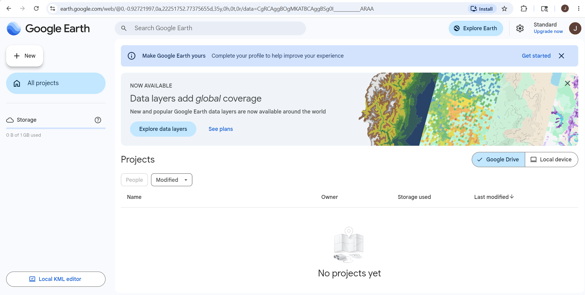
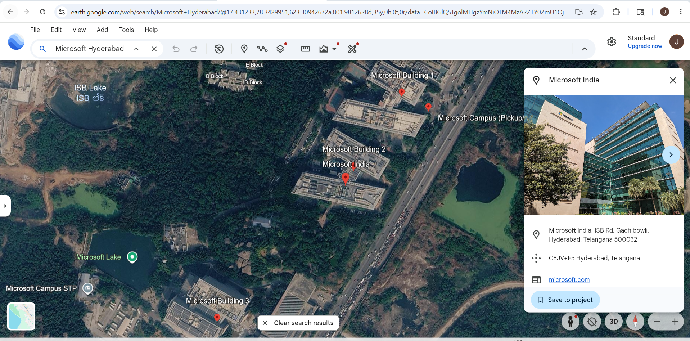

# Google Earth – Footprinting & Reconnaissance

## 1. Overview

**Google Earth** is a satellite-based geographical intelligence tool used to explore locations around the world using high-resolution satellite imagery, 3D buildings, terrain data, and street-level visualization.

In cybersecurity and OSINT, Google Earth is used during the **footprinting phase** to analyze target locations, building layouts, nearby infrastructure, and physical surroundings without directly interacting with the target.

---
## 2. Official Website
https://earth.google.com

---

## 3. Why Security Researchers Use Google Earth

Google Earth is valuable for OSINT because it helps:

- Analyze target locations in detail
- View high-resolution satellite imagery
- Identify building structures
- Observe nearby infrastructure
- Study physical security layouts
- Identify entry and exit routes
- Understand surrounding environment
- Perform passive reconnaissance

---

## 4. Information That Can Be Gathered

| Information | Example |
|-------------|---------|
| Building Layout | Office structure |
| Satellite Images | Real aerial imagery |
| Roads & Routes | Access roads |
| Parking Areas | Employee parking |
| Nearby Buildings | Neighbor organizations |
| Terrain Information | Hills, open areas |
| Entry/Exit Points | Main gates |
| 3D Structures | Building models |
| Geographic Coordinates | Latitude & Longitude |
| Nearby Infrastructure | Airports, stations, ATMs |

---

## 5. How To Use Google Earth

### Step 1 – Open Google Earth

Open browser and visit:
https://earth.google.com

---

### Step 2 – Search Target

Example:
Microsoft Hyderabad

### Information You Can Gather

- Exact location
- Satellite imagery
- Nearby roads
- Office surroundings
- Nearby organizations

---

### Step 3 – Zoom and Explore Area

Use mouse scroll or zoom controls.

### Information Gathered

- Building size
- Road connectivity
- Parking spaces
- Open areas

---

### Step 4 – Enable 3D View

**Steps:**
1. Click 3D option
2. Rotate map view

### Information Gathered

- Building height
- Structural layout
- Nearby buildings
- Rooftop visibility

---

### Step 5 – Measure Distance

**Steps:**
1. Select Measure tool
2. Choose two points

### Information Gathered

- Distance between buildings
- Nearby access routes
- Perimeter estimation

---

