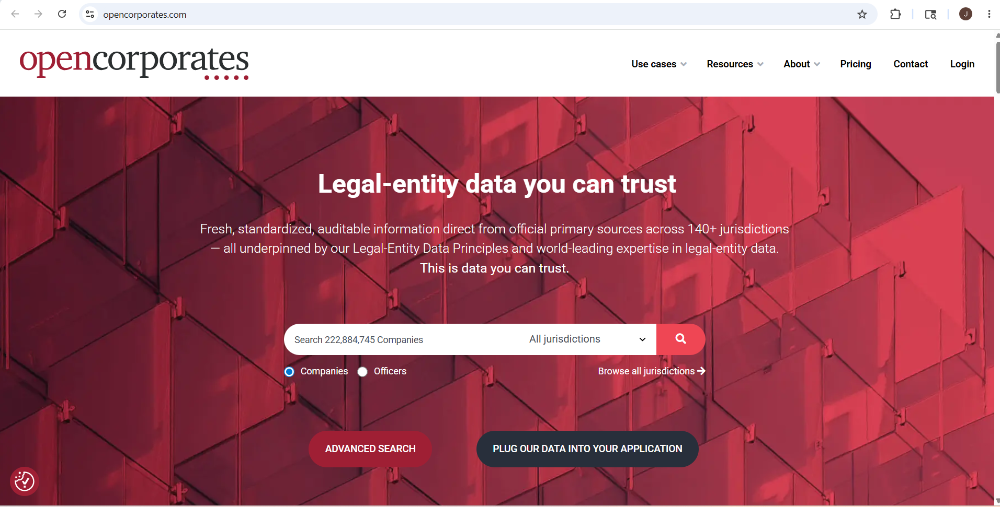
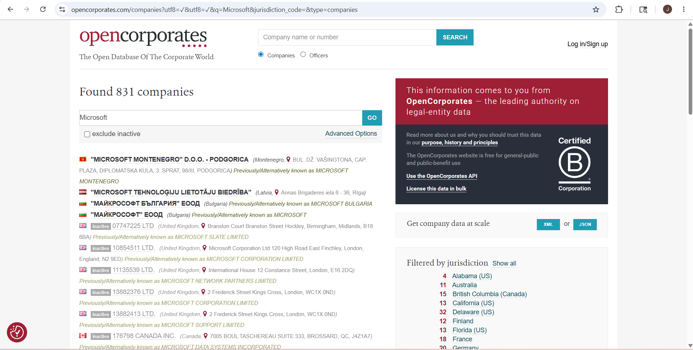
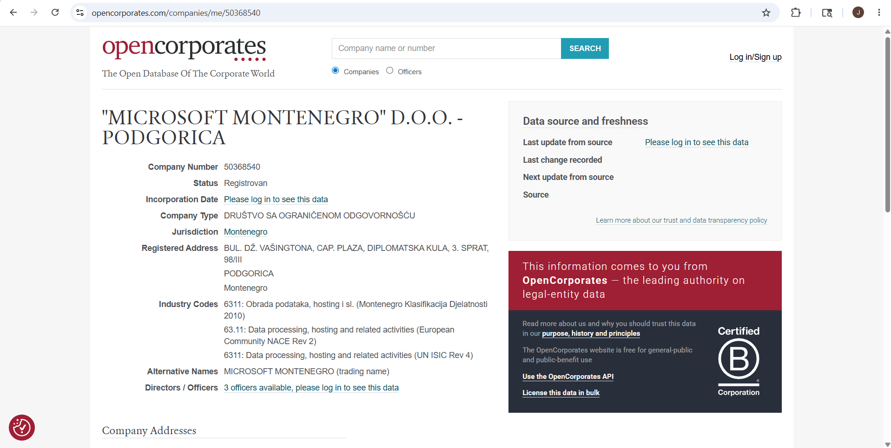

# OpenCorporates – Footprinting & Reconnaissance

## 1. Overview

**OpenCorporates** is a public business intelligence platform used to gather information about companies, organizations, directors, and corporate registrations from multiple countries.

In cybersecurity and OSINT, OpenCorporates is used during the **footprinting phase** to identify company details, business relationships, directors, registration information, and linked organizations using publicly available corporate records.

---

## 2. Official Website
https://opencorporates.com

---

## 3. Why Security Researchers Use OpenCorporates

OpenCorporates is valuable for OSINT because it helps:

- Identify company ownership
- Find directors and officers
- Discover linked companies
- Gather registration information
- Analyze business relationships
- Identify parent organizations
- Perform passive reconnaissance

---

## 4. Information That Can Be Gathered

| Information | Example |
|-------------|---------|
| Company Name | Microsoft Corporation |
| Registration Number | Public company ID |
| Company Status | Active / Closed / Dissolved |
| Directors | Company officers names |
| Registered Address | Office location |
| Jurisdiction | Country/State registration |
| Incorporation Date | Company creation date |
| Related Companies | Subsidiaries and parents |
| Business Type | Private / Public company |
| Company Filings | Public records and statements |

---

## 5. How To Use OpenCorporates

### Step 1 – Open OpenCorporates

Open browser and visit:
https://opencorporates.com

---

### Step 2 – Search Target Company

Example:
Microsoft

### Information You Can Gather

- Company details
- Registration status
- Registered address
- Officers/directors
- Jurisdiction

---

### Step 3 – Open Company Profile

Click on the target company profile from search results.

### Information Gathered

- Company number
- Business status
- Registered office address
- Incorporation details
- Company history

---

### Step 4 – Analyze Directors & Officers

Open the **Officers** or **Directors** section.

### Information Gathered

- Director names
- Officer positions
- Related companies
- Public corporate records

---

### Step 5 – Explore Related Companies

Check linked organizations, subsidiaries, or parent companies.

### Information Gathered

- Parent companies
- Subsidiaries
- Business network
- Corporate structure

---

## 6. Real-World Usage

### Security Researchers Use OpenCorporates To:

- Perform passive reconnaissance
- Verify company legitimacy
- Analyze corporate relationships
- Gather business intelligence
- Identify ownership structures
- Understand corporate hierarchy

### Attackers May Use It To:

- Identify executives and decision-makers
- Gather organizational details
- Find business relationships
- Collect information for social engineering
- Research target companies for phishing

---

OpenCorporates is a powerful OSINT tool for gathering corporate intelligence and business-related information using publicly available company records during the footprinting phase of security assessments.
