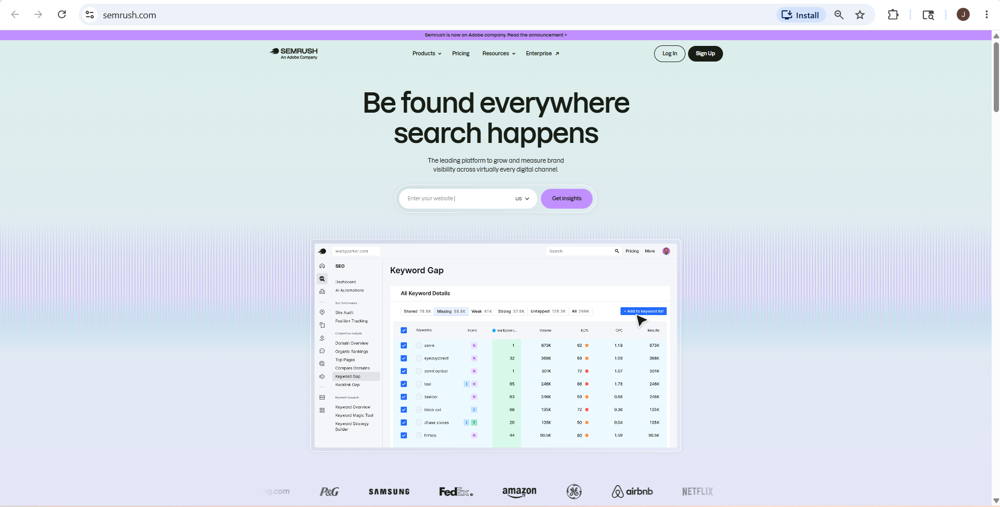
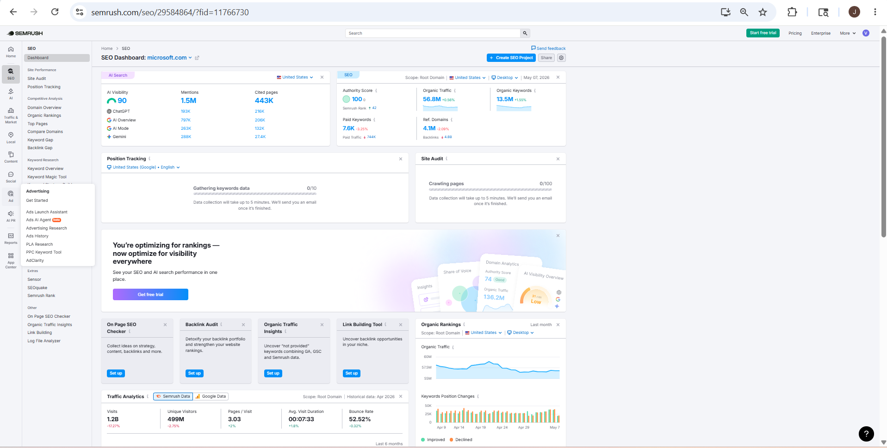
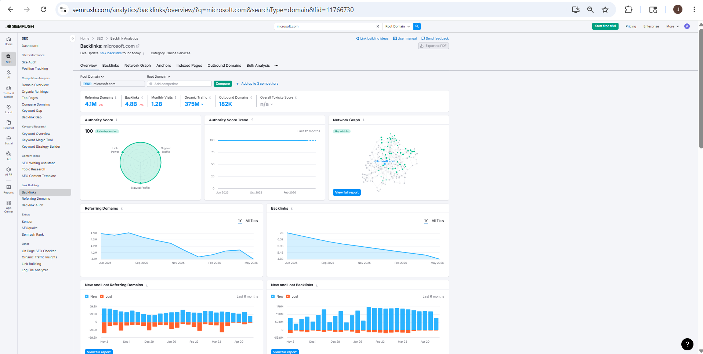
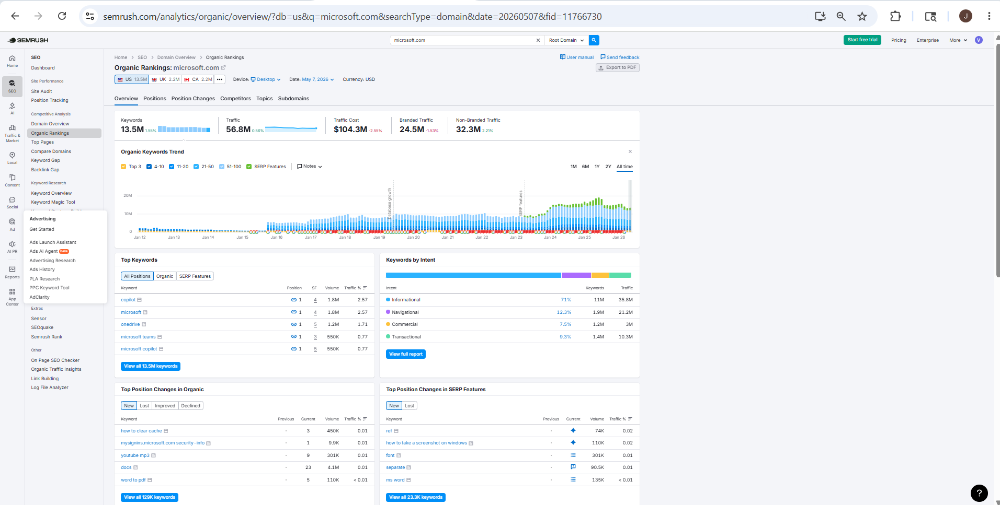

# SEMrush – Footprinting & Reconnaissance

## 1. Overview

**SEMrush** is a website intelligence and SEO analysis platform used to gather information about domains, website traffic, keywords, backlinks, competitors, and online visibility.

In cybersecurity and OSINT, SEMrush is used during the **footprinting phase** to analyze target websites, discover subdomains, identify traffic sources, detect technologies, and gather competitor intelligence using publicly available web data.

---

## 2. Official Website
https://www.semrush.com

---

## 3. Why Security Researchers Use SEMrush

SEMrush is valuable for OSINT because it helps:

- Analyze target websites
- Discover subdomains
- Identify website technologies
- Analyze backlinks
- Find competitor websites
- Monitor domain visibility
- Gather website intelligence
- Perform passive reconnaissance

---

## 4. Information That Can Be Gathered

| Information | Example |
|-------------|---------|
| Domain Information | microsoft.com |
| Website Traffic | Monthly visitors |
| Backlinks | External linked websites |
| Subdomains | login.microsoft.com |
| Top Keywords | SEO keywords |
| Competitors | Similar websites |
| Traffic Sources | Search/social traffic |
| Geographic Traffic | Visitor countries |
| Advertising Data | Paid keywords |
| Top Pages | Popular webpages |

---

## 5. How To Use SEMrush

### Step 1 – Open SEMrush

Open browser and visit:
https://www.semrush.com

---

### Step 2 – Search Target Domain

Example:
microsoft.com

### Information You Can Gather

- Domain overview
- Website traffic
- Backlinks
- Keywords
- Competitors

---

### Step 3 – Analyze Backlinks

Open backlink analytics section.

### Information Gathered

- External linked websites
- Referring domains
- Target pages
- Link sources

---

### Step 5 – Analyze Organic Keywords

Open organic research section.

### Information Gathered

- Ranking keywords
- Popular pages
- Search visibility
- Website content focus

---

