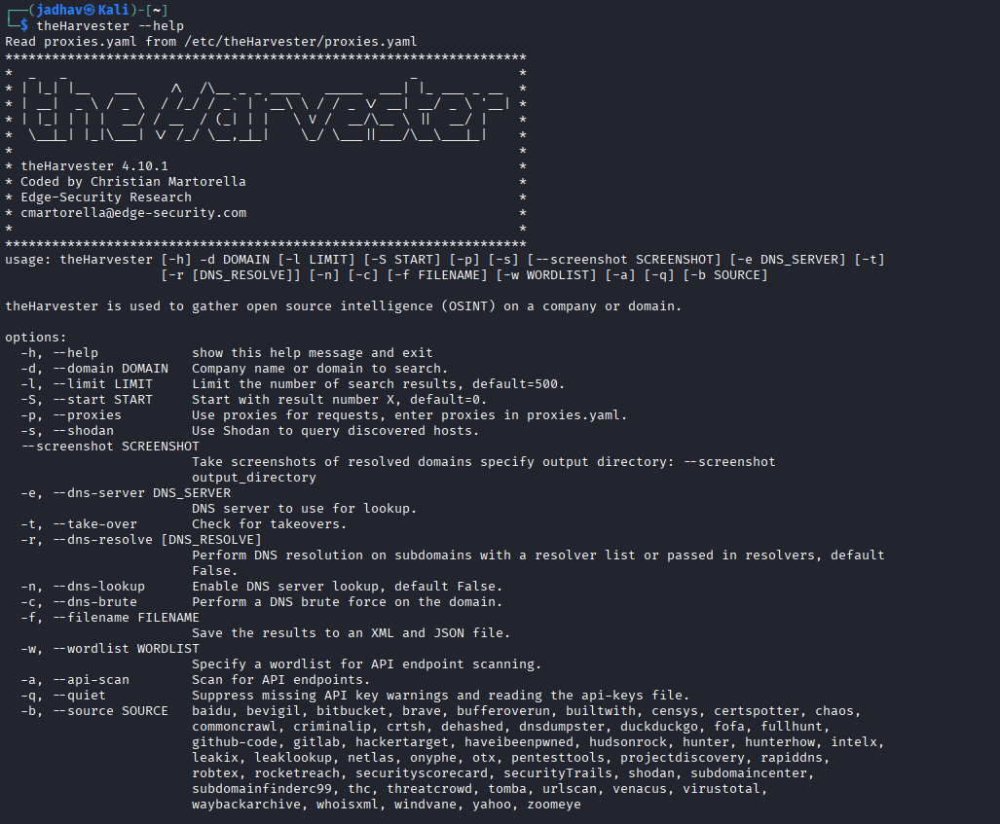

# theHarvester – Footprinting & Reconnaissance

## 1. Overview

**theHarvester** is an OSINT and reconnaissance tool used to gather information such as:

- emails
- subdomains
- hosts
- employee names
- IP addresses

from public sources like search engines, DNS records, and websites.

It is widely used during the **footprinting phase** of penetration testing and cybersecurity assessments.

---

## 2. Official Website
https://github.com/laramies/theHarvester

---

## 3. Why Security Researchers Use theHarvester

theHarvester is valuable for OSINT because it helps:

- Gather employee emails
- Discover subdomains
- Identify hosts
- Collect public intelligence
- Perform passive reconnaissance
- Analyze target infrastructure

---

## 4. Information That Can Be Gathered

| Information | Example |
|-------------|---------|
| Emails | admin@microsoft.com |
| Subdomains | login.microsoft.com |
| Hosts | mail.microsoft.com |
| IP Addresses | Public server IPs |
| Employee Names | Public employee data |
| DNS Information | Domain records |
| URLs | Indexed webpages |


---

## 5. Installation

### Kali Linux

```bash
sudo apt update
sudo apt install theharvester
```


## 6. Start theHarvester
Run:

```bash
 theHarvester --help
```



## 7. Basic Syntax
```bash
theHarvester -d domain -b sourc
```
#### Option	Meaning
- -d	Target domain
- -b	Data source
## 8. Search Emails & Subdomains
Example
```bash
theHarvester -d microsoft.com -b hackertarget
```


