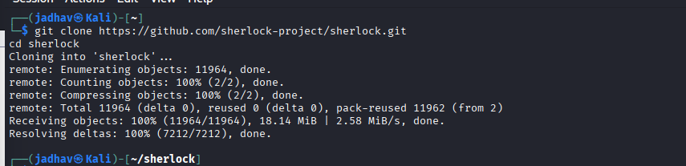
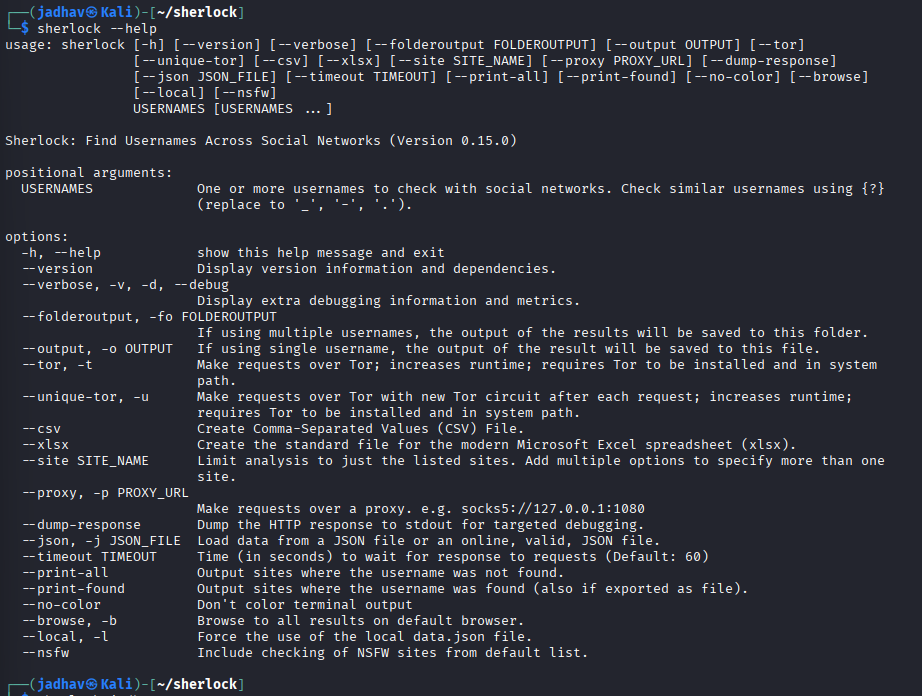

# Sherlock – Footprinting & Reconnaissance

## 1. Overview

**Sherlock** is an OSINT tool used to search usernames across multiple social networking platforms and websites.

It helps security researchers identify where a target username exists online by checking hundreds of websites automatically.

It is widely used during the **reconnaissance phase** of penetration testing and cybersecurity assessments.

---

## 2. Official Website
https://github.com/sherlock-project/sherlock

---

## 3. Why Security Researchers Use Sherlock

Sherlock is valuable for OSINT because it helps:

- Find social media accounts
- Discover usernames across websites
- Gather public profile information
- Track online presence
- Identify linked accounts
- Perform passive reconnaissance

---

## 4. Information That Can Be Gathered

| Information | Example |
|-------------|---------|
| Usernames | johndoe |
| Social Media Accounts | Instagram, X, GitHub |
| Profile URLs | Direct profile links |
| Public Information | Bio, photos |
| Platform Presence | Sites where user exists |
| Related Accounts | Connected usernames |
| Community Profiles | Forums & websites |

---

## 5. Installation

### Kali Linux

```bash
git clone https://github.com/sherlock-project/sherlock.git
cd sherlock
```


## 6. Start Sherlock

``` bash
sherlock --help
```


## 7. Basic Syntax
``` bash
sherlock username
```
#### Option	Meaning
- username	Target username to search
- --output	Save results to file
- --timeout	Set timeout for requests
## 8. Search Username
Example

```bash
sherlock elonmusk
```


