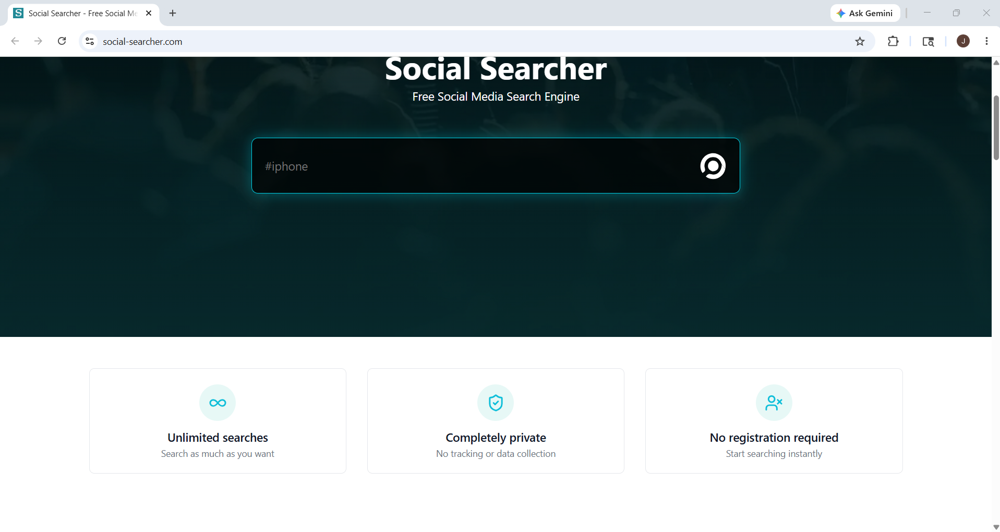
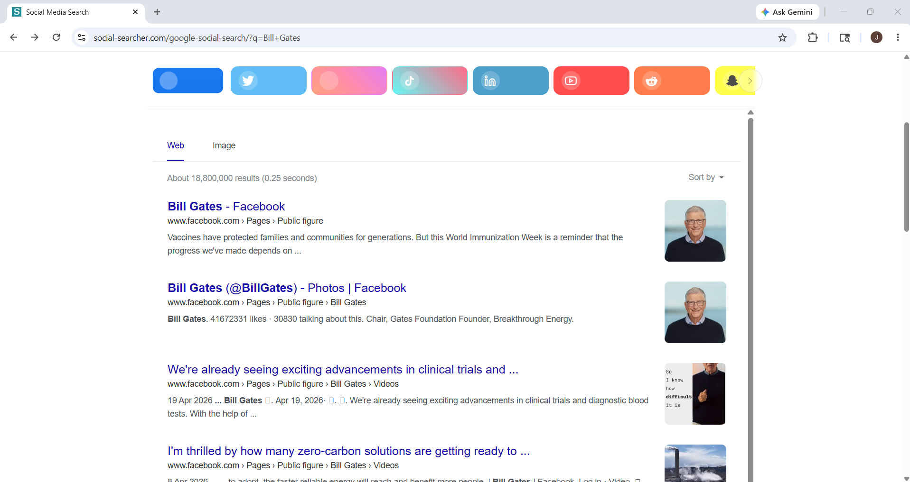
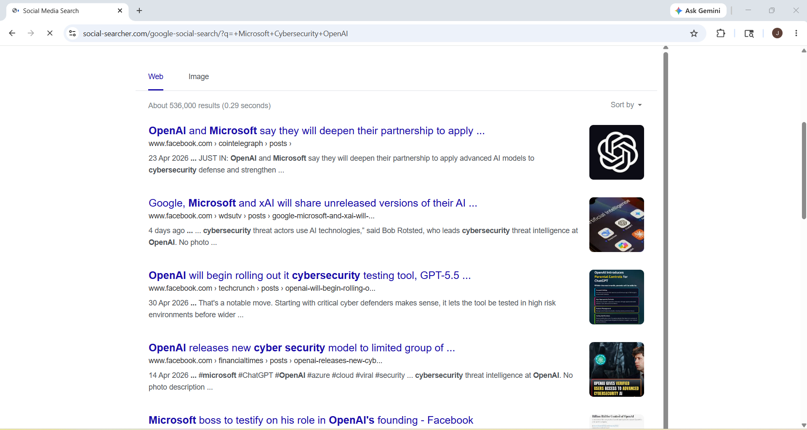

# Social Searcher – Footprinting & Reconnaissance

## 1. Overview

**Social Searcher** is a social media monitoring and analytics tool used to search public content across multiple social networking platforms in real time.

In cybersecurity and OSINT, Social Searcher is used during the **footprinting phase** to track social media activity, analyze public posts, identify user profiles, monitor mentions, and gather publicly available intelligence.

---

## 2. Official Website
https://www.social-searcher.com

---

## 3. Why Security Researchers Use Social Searcher

Social Searcher is valuable for OSINT because it helps:

- Monitor social media activity
- Search public posts
- Track usernames and profiles
- Analyze public discussions
- Monitor brand mentions
- Discover shared content
- Gather social intelligence

---

## 4. Information That Can Be Gathered

| Information | Example |
|-------------|---------|
| Public Posts | Social media posts |
| User Profiles | Public accounts |
| Mentions | Company mentions |
| URLs | Shared links |
| Hashtags | Trending hashtags |
| Keywords | Public discussions |
| Social Activity | User engagement |
| Platforms Used | X, Facebook, Instagram |
| Related Content | Shared articles |
| Real-Time Discussions | Ongoing conversations |

---

## 5. How To Use Social Searcher

### Step 1 – Open Social Searcher

Open browser and visit:
https://www.social-searcher.com

---

### Step 2 – Search Target

Example:
Bill Gates

### Information You Can Gather

---

### Step 3 – Analyze Posts

Social Searcher displays:

- public posts
- URLs
- discussions
- social activity

### Information Gathered

- user interests
- public discussions
- recent activity
- shared content

---

### Step 4 – Analyze Mentions & Keywords

Search keywords such as:
Microsoft
Cybersecurity
OpenAI

### Information Gathered

- trending topics
- public mentions
- company discussions
- social engagement

---
