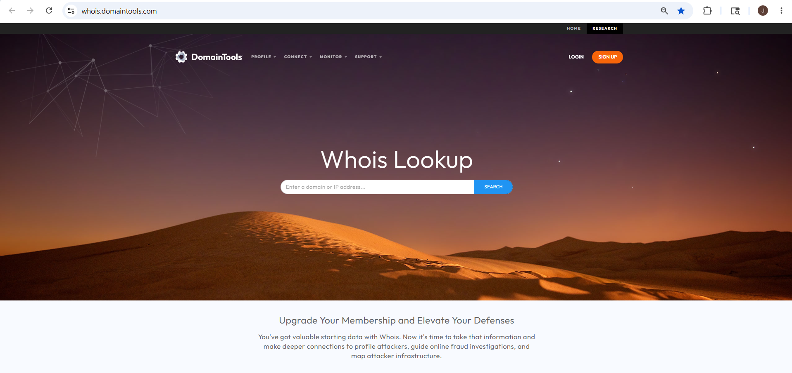
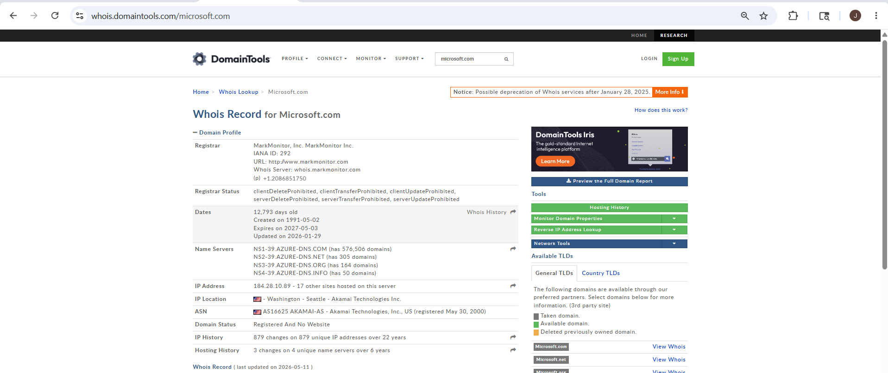
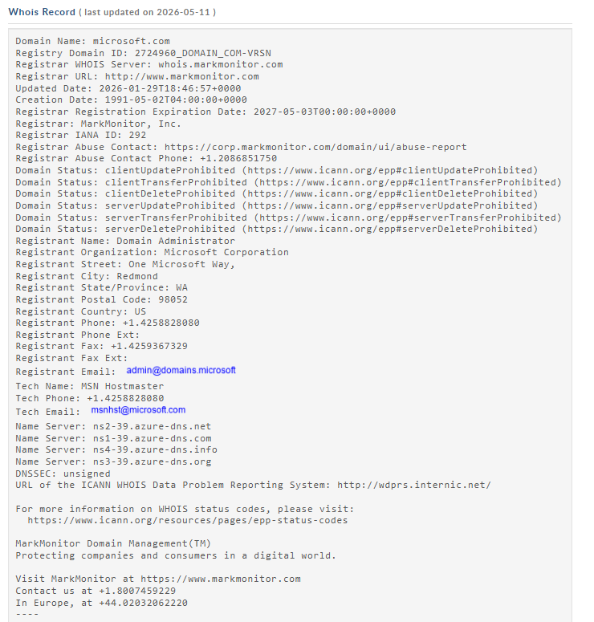

# Whois Lookup – Footprinting & Reconnaissance

## 1. Overview

**Whois Lookup** is an OSINT technique used to gather registration and ownership information about domains, IP addresses, and internet resources.

It queries WHOIS databases that store publicly available information about domain registrations and network ownership.

In cybersecurity and footprinting, Whois Lookup is used during the **reconnaissance phase** to identify domain owners, registrars, name servers, IP ranges, and contact details.


---

## 2. Official Websites
https://whois.domaintools.com
https://www.whois.com/whois

text

---

## 3. Why Security Researchers Use Whois Lookup

Whois Lookup is valuable for OSINT because it helps:

- Identify domain owners
- Discover registrar information
- Find domain creation dates
- Identify name servers
- Gather IP information
- Analyze organization details
- Perform passive reconnaissance


---

## 4. Information That Can Be Gathered

| Information | Example |
|-------------|---------|
| Domain Name | microsoft.com |
| Registrar | GoDaddy |
| Domain Owner | Organization details |
| Creation Date | Domain registration date |
| Expiration Date | Domain expiry |
| Name Servers | ns1.microsoft.com |
| IP Address | Public IP |
| Contact Information | Public email/phone |
| ASN Information | Autonomous System |
| Domain Status | Active/Suspended |


---

## 5. How To Use Whois Lookup (Web)

### Step 1 – Open Whois Website

Open browser and visit:
https://www.whois.com/whois

text



---

### Step 2 – Search Target Domain

Example:
microsoft.com

text

### Information You Can Gather

- registrar details
- domain dates
- name servers
- IP information
- organization details



---

### Step 3 – Analyze Whois Results

Whois displays:

- domain registration data
- registrar information
- domain status
- DNS servers

### Information Gathered

- target organization details
- hosting information
- network ownership
- infrastructure information



---

### Step 4 – Identify Name Servers

Example:
ns1.microsoft.com
ns2.microsoft.com

text

### Information Gathered

- DNS infrastructure
- hosting provider
- network architecture


---

### Step 5 – Analyze Domain Dates

Check:

- creation date
- update date
- expiration date

### Information Gathered

- domain age
- active infrastructure timeline
- organization history


---

## 6. Whois Using Kali Linux

### Basic Command

```bash
whois microsoft.com
https://images/whois/whois-terminal.png

Save Output
bash
whois microsoft.com > whois_result.txt
Lookup IP Address
bash
whois 8.8.8.8
Information Gathered
IP ownership

ISP details

ASN information

network range

https://images/whois/whois-ip.png

7. Real-World Usage
Security Researchers Use Whois Lookup To:
identify domain ownership

analyze infrastructure

gather DNS information

investigate organizations

perform passive reconnaissance

Attackers May Use It To:
gather organization details

identify network infrastructure

discover contact information

map target networks

collect intelligence for social engineering

https://images/whois/whois-usage.png

8. Key Takeaways
Whois Lookup is an essential OSINT technique

Provides domain registration and ownership information

Useful for identifying DNS infrastructure

Helps map organization networks

Should only be used for authorized research

https://images/whois/whois-takeaways.png
