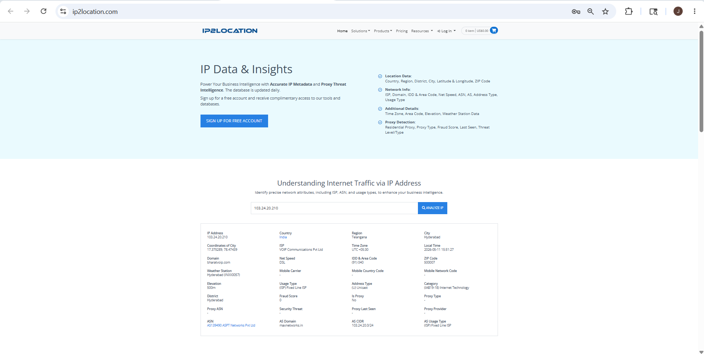
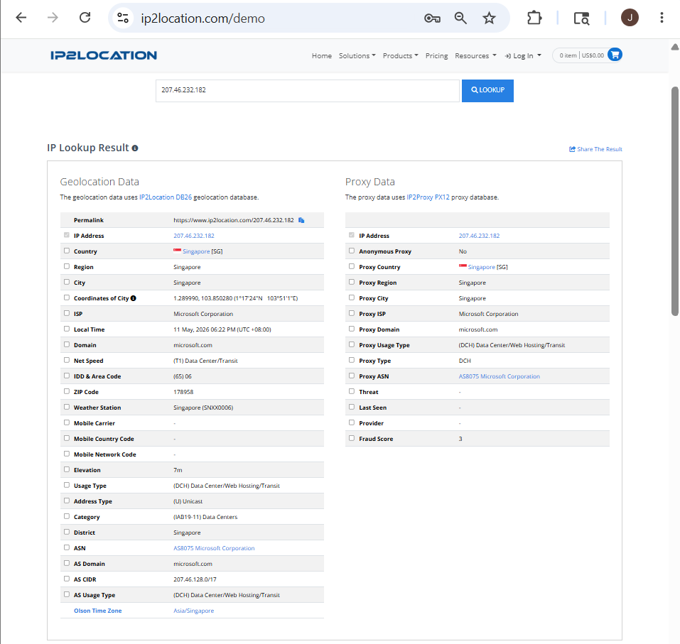

# IP2Location – Footprinting & Reconnaissance

## 1. Overview

**IP2Location** is an IP geolocation lookup tool used to gather geographical and network-related information about an IP address.

It helps identify the physical and network location of a target using publicly available IP intelligence databases.

In cybersecurity and footprinting, IP2Location is used during the **reconnaissance phase** to identify the location, ISP, ASN, hosting provider, and network details of a target system.

---

## 2. Official Website
https://www.ip2location.com

---

## 3. Why Security Researchers Use IP2Location

IP2Location is valuable for OSINT because it helps:

- Identify target location
- Discover ISP information
- Analyze hosting providers
- Identify ASN details
- Detect server regions
- Gather network intelligence
- Perform passive reconnaissance

---

## 4. Information That Can Be Gathered

| Information | Example |
|-------------|---------|
| IP Address | 207.46.232.182 |
| Country | Singapore |
| Region | Singapore |
| City | Singapore |
| ISP | Microsoft Corporation |
| Domain | microsoft.com |
| ASN | AS8075 |
| ZIP Code | 178958 |
| Latitude & Longitude | Geographic coordinates |
| Time Zone | Asia/Singapore |
| Usage Type | Data Center/Hosting |

---

## 5. How To Use IP2Location

### Step 1 – Open IP2Location

Open browser and visit:
https://www.ip2location.com

---

### Step 2 – Enter Target IP Address

Example:
207.46.232.182

### Information You Can Gather

- country
- city
- ISP
- ASN
- domain
- hosting details

---

### Step 3 – Analyze Geolocation Results

IP2Location displays:

- location information
- ISP details
- ASN information
- hosting provider data

### Information Gathered

- server location
- network ownership
- organization information
- hosting infrastructure

---

### Step 4 – Analyze ASN & ISP

Example:
AS8075
Microsoft Corporation

### Information Gathered

- network provider
- organization ownership
- internet infrastructure
- hosting network

---

### Step 5 – Analyze Usage Type

Example:
Data Center/Web Hosting/Transit

### Information Gathered

- server usage
- hosting environment
- infrastructure type

---

## 6. Real-World Usage

### Security Researchers Use IP2Location To:

- identify server locations
- analyze network infrastructure
- investigate IP ownership
- gather geolocation intelligence
- perform passive reconnaissance

### Attackers May Use It To:

- identify target regions
- analyze hosting infrastructure
- gather ISP details
- plan social engineering attacks
- identify server environments

---

## 7. Key Takeaways

- IP2Location is a powerful IP geolocation OSINT tool
- Provides location, ISP, ASN, and hosting information
- Useful for identifying server infrastructure
- Helps map network ownership
- Should only be used for authorized research

