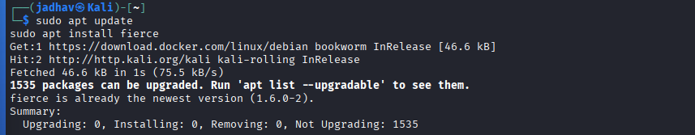
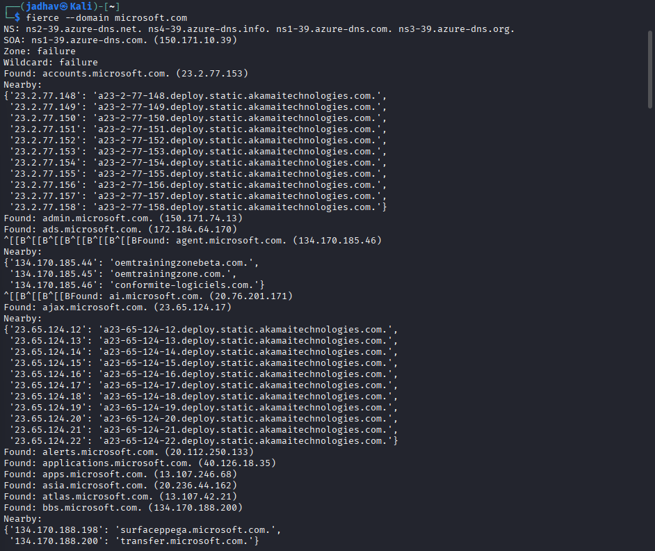

# Fierce – DNS Footprinting & Reconnaissance

## 1. Overview

**Fierce** is a DNS reconnaissance and subdomain enumeration tool used to gather DNS information about a target domain.

It helps identify:
- subdomains
- IP addresses
- DNS servers
- nearby hosts
- network structure

In cybersecurity and footprinting, Fierce is used during the **reconnaissance phase** to map target infrastructure and discover exposed systems.


---

## 2. Official Website
https://github.com/mschwager/fierce

---

## 3. Why Security Researchers Use Fierce

Fierce is valuable for DNS reconnaissance because it helps:

- Discover subdomains
- Perform DNS enumeration
- Identify nearby IP ranges
- Analyze DNS infrastructure
- Detect exposed hosts
- Map target networks
- Perform passive reconnaissance

---

## 4. Information That Can Be Gathered

| Information | Example |
|-------------|---------|
| Subdomains | mail.microsoft.com |
| IP Addresses | 13.107.x.x |
| DNS Servers | ns1.microsoft.com |
| Nearby Hosts | adjacent IP systems |
| Mail Servers | MX records |
| Web Servers | HTTP-enabled systems |
| Network Structure | public infrastructure |


---

## 5. Installation

### Kali Linux

```bash
sudo apt update
sudo apt install fierce
```


## 6. Basic Syntax
```bash
fierce --domain target.com
```
### Part	Meaning
- fierce	Tool
- --domain	Target domain
## 7. Basic Domain Scan
Example
```bash
fierce --domain microsoft.com
```
### Information Gathered
- DNS servers
- subdomains
- nearby IP addresses
- network structure


