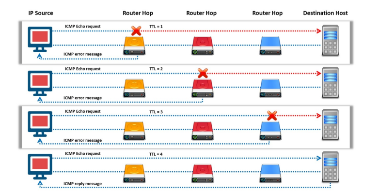
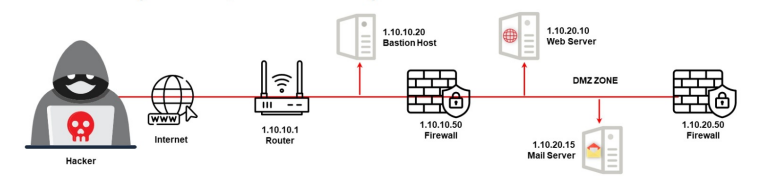
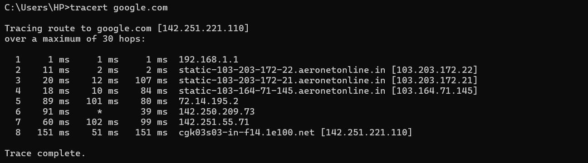
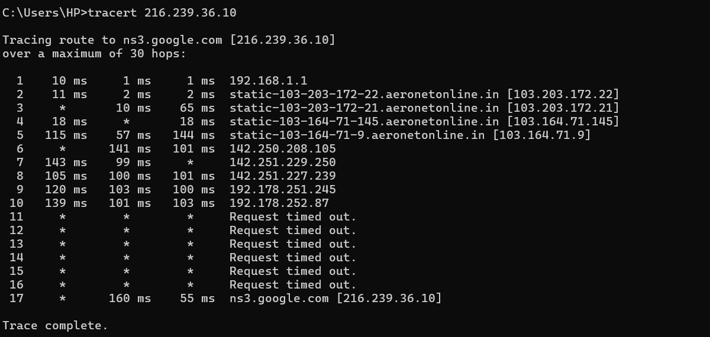
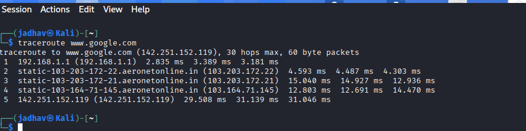

# Traceroute – Footprinting & Reconnaissance

## 1. Overview

**Traceroute** is a network reconnaissance utility used to identify the path packets travel from a source system to a destination host.

It helps reveal:
- routers
- intermediate devices
- firewalls
- network hops
- response times

In cybersecurity and footprinting, traceroute is used during the **reconnaissance phase** to map network paths and analyze network infrastructure.



---

## 2. Why Security Researchers Use Traceroute

Traceroute is valuable because it helps:

- Identify network routes
- Discover intermediate routers
- Detect firewalls
- Analyze network topology
- Measure latency
- Identify network bottlenecks
- Perform network reconnaissance


---

## 3. Information That Can Be Gathered

| Information | Example |
|-------------|---------|
| Router IPs | 192.168.0.1 |
| Network Hops | Hop-by-hop route |
| Hostnames | router.example.com |
| Response Time | 20 ms |
| ISP Information | Internet provider |
| Firewall Presence | Filtered hops |
| Geographic Routing | Approximate locations |


---

## 4. How Traceroute Works

Traceroute uses:
- ICMP
- UDP
- TCP
- TTL (Time To Live)

to discover each router between the source and destination.

Each router decreases the TTL value by 1.

When TTL becomes `0`, the router sends an ICMP error reply back to the sender.

Traceroute repeats this process to identify all intermediate hops.



---
## 5. ICMP Traceroute (Windows)

### Basic Command

```cmd
tracert google.com
```

or

```cmd
tracert 216.239.36.10
```

### Information Gathered
- router IPs
- hop count
- response time
- intermediate systems


## 6. UDP Traceroute (Linux)
Linux traceroute commonly uses UDP packets.

### Basic Command
```bash
traceroute www.google.com
```
### Information Gathered
- network path
- routers
- latency
- route changes




## 9. Important Concepts
### Hop
- Each router between source and destination.
- TTL (Time To Live)
Limits how many routers a packet can pass through.
- Latency
Response time between systems.

Example:

text
10 ms
20 ms
50 ms
Higher latency may indicate:

distant locations

congestion

filtering

