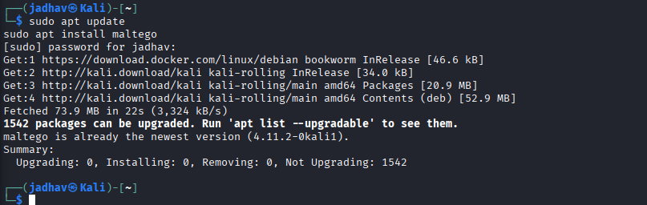
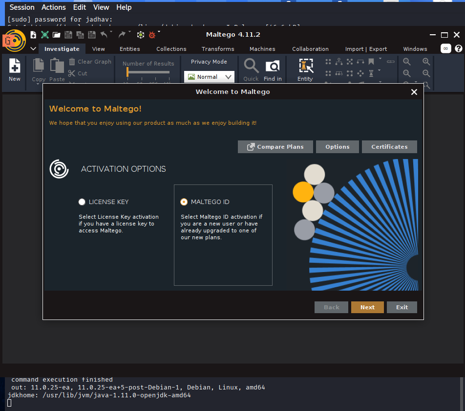

# Maltego – Complete Beginner to Advanced Guide for Footprinting & OSINT

Maltego is one of the most powerful OSINT and reconnaissance tools used in cybersecurity. It helps investigators visualize relationships between domains, IPs, people, emails, organizations, infrastructure, and social media accounts using graphical analysis.


---

## 1. Overview

**Maltego** is an automated OSINT (Open Source Intelligence) tool used to gather and visualize information about a target.

Unlike normal tools that show only text results, Maltego creates:

- relationship graphs
- infrastructure maps
- connection analysis

It is mainly used during:

- Footprinting
- Reconnaissance
- Threat Intelligence
- OSINT Investigations
- Social Media Investigations


---
## 2. Official Website
https://www.maltego.com

---

## 3. Why Security Researchers Use Maltego

Maltego helps researchers:

- Discover subdomains
- Gather email addresses
- Find DNS records
- Analyze internet infrastructure
- Investigate organizations
- Map relationships
- Track digital footprints
- Visualize OSINT data
- Automate reconnaissance


---

## 4. Types of Reconnaissance in Maltego

According to Maltego documentation and OSINT usage, Maltego supports two main reconnaissance types:

### A. Infrastructure Reconnaissance

Focuses on:

- domains
- DNS
- subdomains
- IP addresses
- mail servers
- hosting infrastructure

### B. Personal Reconnaissance

Focuses on:

- people
- phone numbers
- social media
- email addresses
- organizations


---

## 5. Maltego Versions

| Version | Description |
|---------|-------------|
| Maltego CE | Free Community Edition |
| Maltego Classic | Professional Edition |
| Maltego XL | Large-scale investigations |
| CaseFile | Offline graph analysis |

**For learning: Use Maltego CE**


---

## 6. Important Concepts

Before using Maltego, understand these two concepts.

---

## A. What is an Entity?

Everything in Maltego is called an **Entity**.

Examples:

- Domain
- Email
- Website
- Person
- Company
- Phone Number
- IP Address

You drag entities into the graph workspace.

---

## B. What is a Transform?

**Transforms** are automated actions.

Example:
Domain → Find Subdomains
Domain → Find DNS Records
Email → Find Social Accounts


Transforms automatically gather information.

---

## 7. Information That Can Be Gathered

| Information | Example |
|-------------|---------|
| Domains | microsoft.com |
| Emails | admin@microsoft.com |
| IP Addresses | 13.x.x.x |
| DNS Records | MX, NS, TXT |
| Subdomains | login.microsoft.com |
| WHOIS Data | Domain ownership |
| Organizations | Microsoft |
| Social Media | LinkedIn accounts |
| Phone Numbers | Public contacts |


---

## 8. Installation

### Kali Linux Installation

Maltego is usually pre-installed in Kali Linux.

Check:

```bash
maltego
```
If not installed:

```bash
sudo apt update
sudo apt install maltego
```
Windows/Linux/Mac Download
- Download from:  https://www.maltego.com/downloads
  ---

## 9. Starting Maltego
Run:

``` bash
maltego
```
OR open from:

Applications → Information Gathering → Maltego
---
# Maltego Installation & Setup Guide


### 1. Run Installer



> Click "Next" to continue

### 2. Activation Method

- Select **"Default Online Activation"**
- Click "Next"

### 3. License Agreement

- Accept terms
- Click "Next"

### 4. Login to Maltego

**Option:** Click **"Browser Login"** button

### 5. Browser Login Page

- Click **"Create ID"** (if no account exists)

### 6. Account Creation Form

- Enter email address
- Enter first and last name
- Click "Continue"

### 7. Create Password

- Create strong password
- Click "Continue"

### 8. OTP Verification

- Check email for OTP code
- Enter code
- Click "Verify"

### 9. Country & Phone

- Select country
- Enter phone number
- Click "Continue"

### 10. Additional Questions

- Answer optional questions
- Click "Continue"
- Close browser and return to Maltego

### 11. Activation Complete

- Click "Next"

### 12. Data Sources

- Utilities already selected (keep as is)
- Click "Next"

### 13. Terms & Conditions

- Accept terms and conditions
- Click "Next" (continue through prompts)

### 14. Browser Options

- Select your preferred web browser
- Click "Next"

### 15. Privacy Mode

- **Select: Normal Mode**
  > *Why Normal?* Stealth mode blocks IP exposure but may limit some investigations. Normal mode allows full functionality.

- Click "Next"

### 16. Finish Installation

- Click "Finish"
- Maltego opens with blank graph

### 17. Privacy Policy Notice

- Click **"Acknowledge"**

### 18. Tutorial Guide

- Tutorial starts automatically (follow or skip)

### 19. Entity Palette

- **Left panel:** Entity Palette (where drag-and-drop entities live)
- Ready for investigations!


## 10. Understanding the Interface
#### Section	Purpose
- Entity Palette	Contains entities
- Graph Area	Workspace
- Transform Menu	Runs transforms
- Output Window	Shows results
- Property Panel	Entity information

## 12. Basic Workflow of Maltego
This is the MOST IMPORTANT section.

Maltego works like this:

Add Entity
      ↓
Run Transform
      ↓
Get Related Information
      ↓
Run More Transforms
      ↓
Build Intelligence Graph

## 13. Creating Your First Investigation
### Step 1 – Create New Graph
Click: New Graph

This creates a blank workspace.

### Step 2 – Add Domain Entity
From left side: Entity Palette

Search: Domain

Drag it into graph workspace.

### Step 3 – Set Target Domain
Double click entity.

Replace paterva.com with:

microsoft.com
OR

tesla.com
### Step 4 – Run Transforms
Right click: Domain Entity

Select: Run All Transforms

OR choose specific transforms.

### Step 5 – Wait for Results
Maltego now gathers:

- DNS records

- emails

- IP addresses

- subdomains

- organizations

- servers

- Graph expands automatically.


## 14. Understanding the Results
You may see:

microsoft.com
    ↓
mail.microsoft.com
    ↓
IP Address
    ↓
Organization
This shows relationships between infrastructure.


18. Most Important Transforms
Domain → DNS Names
Finds:

subdomains

DNS infrastructure

Example:

text
vpn.microsoft.com
login.microsoft.com
mail.microsoft.com
Domain → IP Address
Finds:

public IPs

hosting servers

Domain → MX Records
Finds:

mail servers

Example:

text
mail.microsoft.com
smtp.microsoft.com
Domain → WHOIS Records
Finds:

registrar

ownership info

registration details

Email → Social Accounts
Finds:

linked accounts

social media presence

https://images/maltego/maltego-important-transforms.png

19. Practical Example – Domain Investigation
Target:
text
amazon.com
Step 1
Add: Domain Entity

Step 2
Rename: amazon.com

Step 3
Run: Run All Transforms

Step 4
Observe Results

You may find:

email addresses

subdomains

mail servers

DNS records

phone numbers

https://images/maltego/maltego-domain-investigation.png

20. Practical Example – Email Investigation
Maltego can investigate emails too.

Step 1
Create: New Graph

Step 2
Search: Email Address

Drag into workspace.

Step 3
Enter email:

text
example@gmail.com
Step 4
Run: Run All Transforms

Step 5
Possible Results

linked accounts

associated names

organizations

leaked data

social profiles

https://images/maltego/maltego-email-investigation.png

21. Infrastructure Mapping
Maltego can map:

DNS

subdomains

IP ranges

mail servers

infrastructure

This helps understand:

network structure

exposed assets

internet presence

https://images/maltego/maltego-infrastructure.png

22. Real-World Usage
Security Researchers Use Maltego To:
perform OSINT

investigate organizations

map infrastructure

analyze relationships

gather intelligence

Attackers May Use It To:
gather employee information

discover infrastructure

identify exposed systems

plan phishing attacks

perform social engineering

https://images/maltego/maltego-usage.png

23. Advantages of Maltego
Advantage	Benefit
Visual Graphs	Easy analysis
Automation	Faster reconnaissance
Relationship Mapping	Better intelligence
Multiple Data Sources	More information
OSINT Integration	Powerful investigations
24. Limitations of Maltego CE
Community Edition limitations:

limited transforms

limited entities

slower results

some APIs require signup

https://images/maltego/maltego-limitations.png

25. Best Beginner Practice
Practice on:

your own domain

public companies

test environments

Good beginner targets:

microsoft.com

tesla.com

github.com

26. Important Learning Strategy
Do NOT run Run All Transforms immediately every time.

Instead:

start small

analyze results

run targeted transforms

build investigation slowly

This helps understand relationships better.

27. Best Beginner Workflow
Step	Action
1	Add Domain Entity
2	Set target: microsoft.com
3	Run To DNS Names
4	Run To IP Addresses
5	Run To WHOIS Records
6	Analyze relationships visually
This workflow is enough to understand:

OSINT

reconnaissance

infrastructure mapping

relationship analysis

https://images/maltego/maltego-beginner-workflow.png

28. Important Commands / Actions Summary
Action	Purpose
New Graph	Create investigation
Add Entity	Add target
Run Transform	Gather information
Run All Transforms	Full investigation
Zoom Graph	Analyze visually
Double Click Entity	Edit target
29. Most Important Thing to Remember
Maltego is NOT just a scanning tool.

It is a relationship intelligence platform.

The main goal is discovering hidden connections between:

people

organizations

infrastructure

domains

emails

social accounts

https://images/maltego/maltego-key-takeaway.png

30. Final Conclusion
Maltego is one of the most powerful OSINT and footprinting tools used in cybersecurity. It automates reconnaissance, maps relationships visually, and helps investigators analyze infrastructure, domains, people, and organizations efficiently.

It is widely used in:

penetration testing

threat intelligence

OSINT investigations

digital forensics

reconnaissance operations

For beginners, the best way to learn Maltego is:

Start with domains

Run basic transforms

Understand relationships

Explore graphs step by step

Once mastered, Maltego becomes an extremely powerful intelligence gathering platform.

https://images/maltego/maltego-conclusion.png
