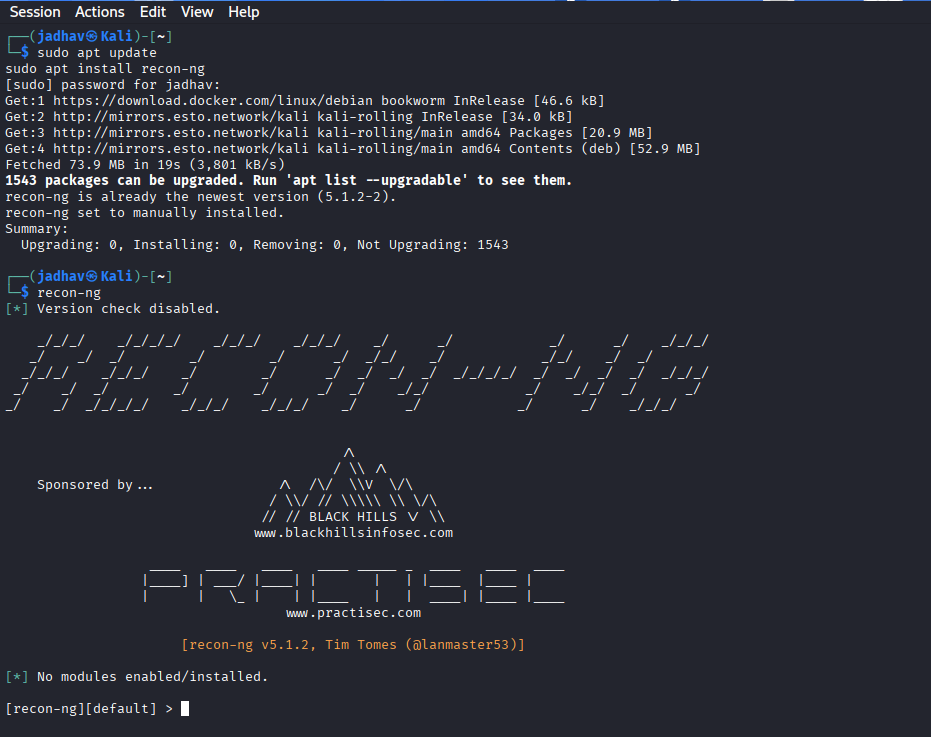
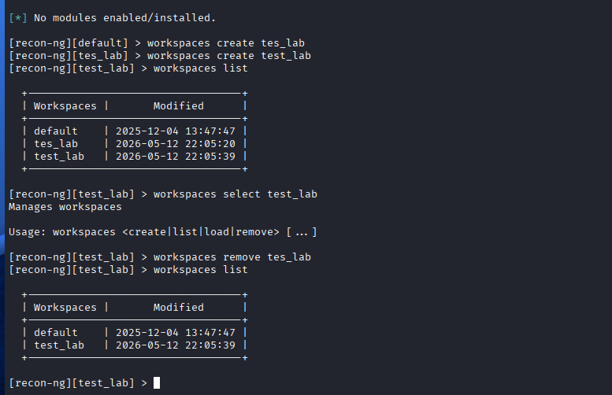
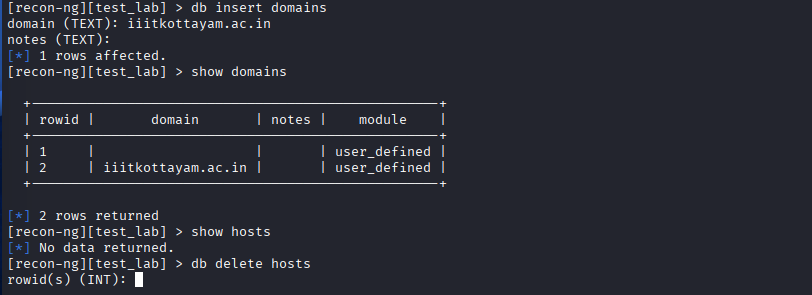
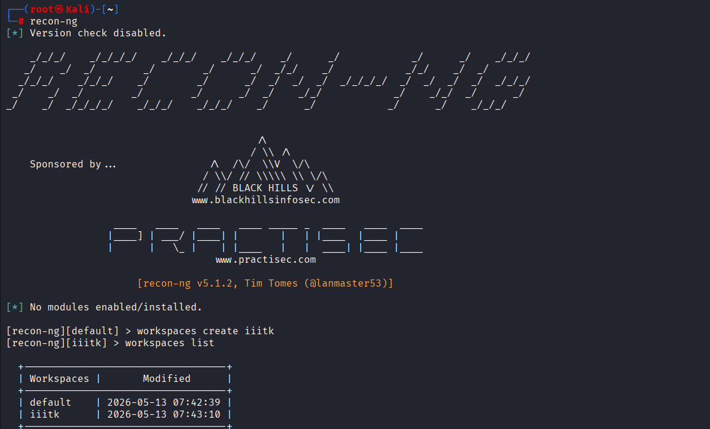
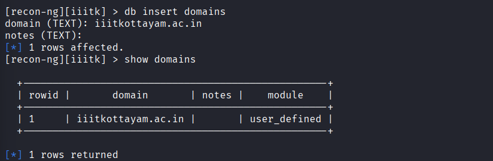
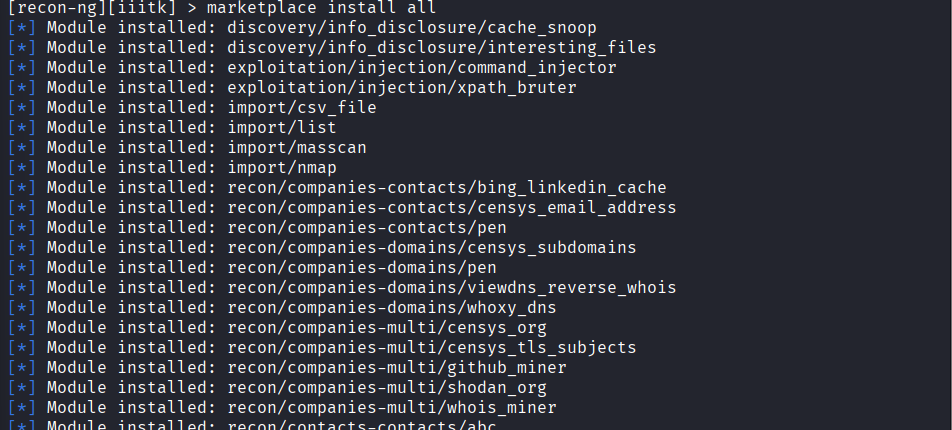
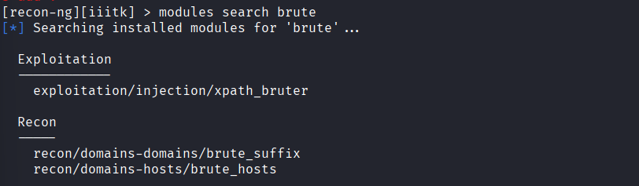
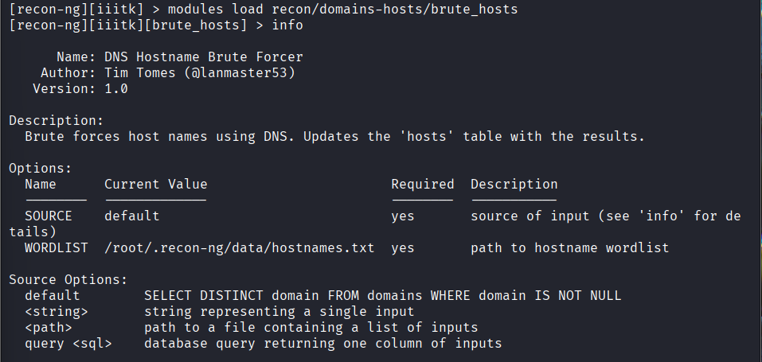
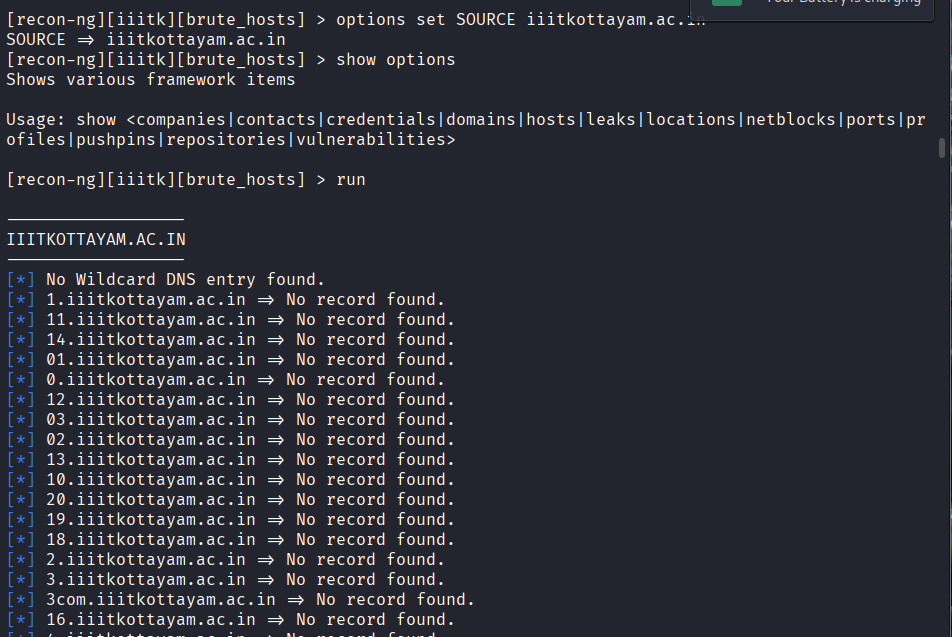

# Recon-ng 
## Overview

Recon-ng is an Open Source Intelligence (OSINT) and reconnaissance framework used for automated information gathering during penetration testing and ethical hacking.

It helps security professionals gather:

- Subdomains
- Hosts
- IP addresses
- Whois data
- Contacts
- Technologies
- Open ports
- OSINT intelligence

---

# Why Recon-ng?

Recon-ng is useful for:

- Footprinting
- Reconnaissance
- Bug bounty hunting
- Red teaming
- Ethical hacking
- OSINT investigations

---

# Features

- Modular architecture
- Built-in database
- Workspace management
- API integration
- Automated reconnaissance
- Reporting support
- Web interface support
- Data correlation

---

# Architecture

```text
Recon-ng
│
├── Workspaces
├── Database
├── Modules
├── API Keys
├── Reports
└── Dashboard
```

---

# Installation

## Kali Linux Installation

```bash
sudo apt update
sudo apt install recon-ng
```

Start Recon-ng:

```bash
recon-ng
```

---

## Screenshot



---

# Manual Installation

```bash
git clone https://github.com/lanmaster53/recon-ng.git

cd recon-ng

pip3 install -r REQUIREMENTS

python3 recon-ng
```
---

# Basic Workflow

```text
Create Workspace
        ↓
Insert Target Domain
        ↓
Install Modules
        ↓
Load Module
        ↓
Set Options
        ↓
Run Module
        ↓
View Results
        ↓
Generate Report
```

---

# Workspaces

## What is Workspace?

Workspace = Separate project environment

Stores:
- Domains
- Hosts
- Contacts
- Results
- Reports

---

# Workspace Commands

## Create Workspace

```bash
workspaces create test_lab
```

## List Workspaces

```bash
workspaces list
```

## Select Workspace

```bash
workspaces select ceh_lab
```

## Remove Workspace

```bash
workspaces remove ceh_lab
```

---

## Screenshot



---

# Database

Recon-ng stores information inside its built-in database.

---

# Database Tables

```text
companies
contacts
credentials
domains
hosts
leaks
locations
netblocks
ports
profiles
repositories
vulnerabilities
```

---

# Insert Domain

```bash
db insert domains
```

Enter:

```text
iiitkottayam.ac.in
```

---

# Show Domains

```bash
show domains
```

---

# Show Hosts

```bash
show hosts
```

---

# Delete Data

```bash
db delete hosts
```

---

## Screenshot



---

# Marketplace

Marketplace contains Recon-ng modules.

---

# Search Modules

```bash
marketplace search
```

---

# Search Specific Module

```bash
marketplace search dns
```

---

# Install All Modules

```bash
marketplace install all
```

---

# Install Single Module

```bash
marketplace install recon/domains-hosts/hackertarget
```

---

# Remove Module

```bash
marketplace remove recon/domains-hosts/hackertarget
```

---


---

# Modules

## What are Modules?

Modules automate reconnaissance tasks.

Examples:
- Subdomain enumeration
- Whois lookup
- Contact harvesting
- Technology detection

---

# View Installed Modules

```bash
modules search
```

---

# Load Module

```bash
modules load recon/domains-hosts/brute_hosts
```

---

# Module Information

```bash
info
```

Shows:
- Description
- Author
- Required options
- API dependency

---

# Show Options

```bash
show options
```

---

# Set Target

```bash
options set SOURCE example.com
```

---

# Unset Option

```bash
options unset SOURCE
```

---

# Run Module

```bash
run
```

---


---

# Important Recon Modules

# Step 1 Start Recon-ng

Launch the Recon-ng framework.

```bash
recon-ng
```

# Step 2 Create Workspace

Create a workspace for the reconnaissance project.

```bash
workspaces create iiitk
```
# Step 3 List Available Workspaces

Verify the created workspace.

```bash
workspaces list
```

## Screenshot



# Step 4 Insert Target Domain

Add the target domain into the Recon-ng database.

```bash
db insert domains
```
## Input

```text
iiitkottayam.ac.in
```

# Step 5  Verify Stored Domains

Display domains stored inside the database.

```bash
show domains
```




# Step 6 Install All Modules

Install all available Recon-ng modules.

--

## Command

```bash
marketplace install all
```


> **Note:**  
> During module installation and execution, Recon-ng may display some warning or error messages in red color related to missing API keys or optional dependencies.  
> These warnings can be ignored for basic reconnaissance and subdomain enumeration because the core modules still function correctly.

# Step 7  Search brute_hosts Module Again

Verify the brute_hosts module is installed.

```bash
modules search brute
```




# Step 8 Load brute_hosts Module

Load the DNS brute force module.


```bash
modules load recon/domains-hosts/brute_hosts
```

# Step 9 View Module Information

Display module information and requirements.


```bash
info
```




# Step 10 — Set Target Domain

Configure the target domain for enumeration.

```bash
options set SOURCE iiitkottayam.ac.in
```

# Step 11  Run brute_hosts Module

Execute the module to discover subdomains.


```bash
run
```




# Step 12 — View Stored Hosts

Display discovered hosts stored inside the database.


```bash
show hosts
```


---
