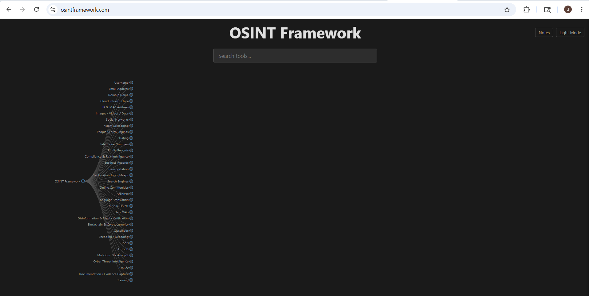
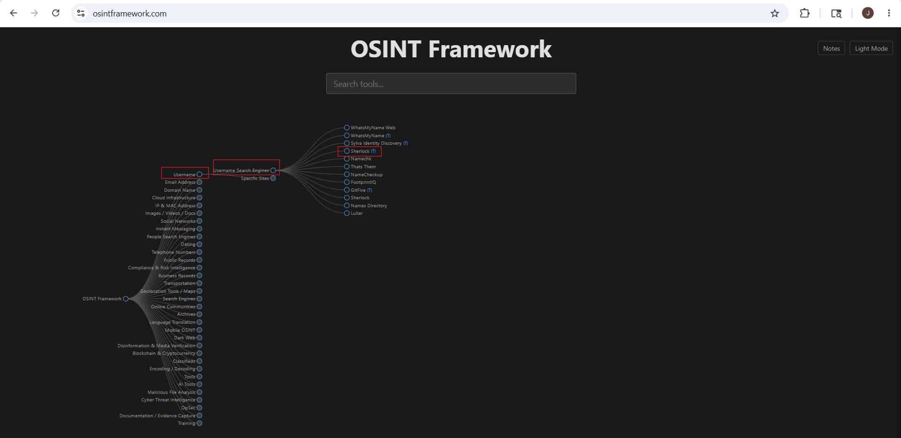

# OSINT Framework

## Source

https://osintframework.com

---

# Overview

OSINT Framework is an open-source intelligence gathering framework used for:
- Footprinting
- Reconnaissance
- OSINT investigations
- Intelligence gathering

It organizes various OSINT tools and resources into a tree-based structure for easier navigation and investigation.

The framework helps security professionals quickly find tools related to:
- Domains
- IP addresses
- Emails
- Social media
- Metadata
- Public records
- Threat intelligence

---

# Features

- Web-based interface
- Categorized OSINT resources
- Domain investigation tools
- Email intelligence tools
- Social media investigation
- Metadata analysis tools
- Dark web resources
- Threat intelligence references

---

# Main Categories

- Username Search
- Email Address
- Domain Name
- IP Address
- Social Networks
- Public Records
- Geolocation
- Metadata
- Dark Web
- Malware Analysis
- Threat Intelligence

---

# Indicators Used in OSINT Framework

| Indicator | Meaning |
|---|---|
| (T) | Tool must be installed locally |
| (D) | Google dork |
| (R) | Requires registration |
| (M) | URL must be manually edited |

---

# Purpose

OSINT Framework helps investigators quickly locate:
- Whois tools
- DNS tools
- Archive tools
- Search engine tools
- Email investigation resources
- Social media intelligence tools

Instead of manually searching for OSINT resources, the framework organizes them in a structured format.

---

# Access OSINT Framework

Open in browser:

```text
https://osintframework.com
```

---




---

# Important Note

> OSINT Framework itself is not a scanning tool.
>
> It is a collection and organization platform for OSINT resources and reconnaissance tools.

---

# Example Usage — Sherlock Username Investigation using OSINT Framework

This example demonstrates how OSINT Framework can be used to locate username investigation tools such as Sherlock.

# Step 1 — Open OSINT Framework

Open:

```text
https://osintframework.com
```

---

# Step 2 — Navigate to Username Category

Inside the OSINT Framework tree structure:

```text
Username
    └── Username Search Engines
            └── Sherlock



---

# Step 3 — Open Sherlock Tool

Sherlock is used for username enumeration across multiple social media platforms.

---

# Step 5 — Run Sherlock


